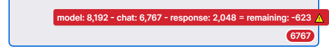
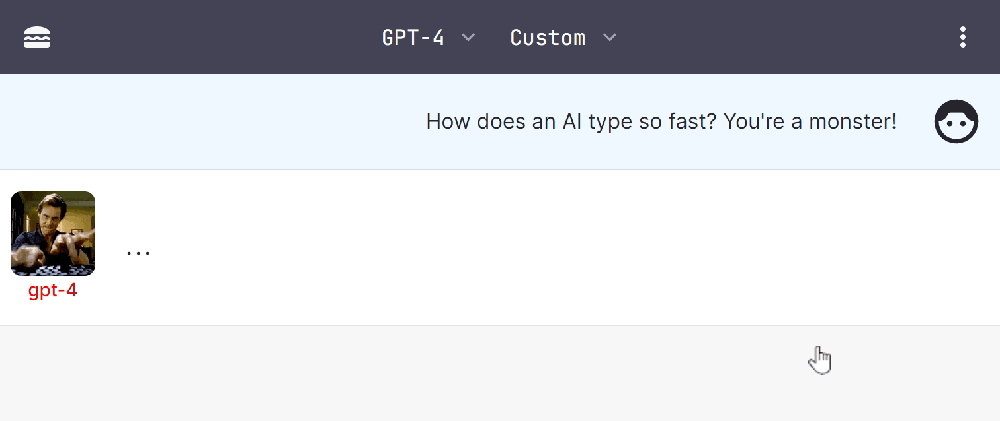
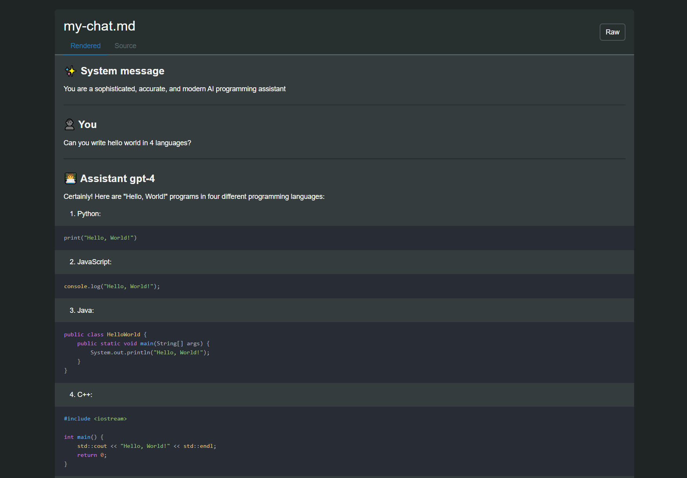
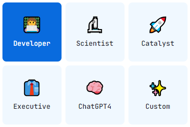
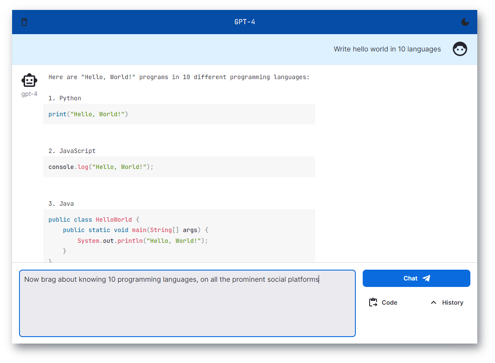

# Next.js ChatGPT 🤖💬

Welcome to `nextjs-chatgpt-app`! 🎉🚀 Responsive chat application powered by OpenAI's GPT-4, with chat streaming, code
highlighting, code execution, development presets, and more. The app is built using Next.js and TypeScript, and it's
designed to be easy to use, customize, and extend. We encourage you to contribute and help improve this project! 😊

[](https://nextjs-chatgpt-app-enricoros.vercel.app)

Or click fork & run on Vercel

[](https://vercel.com/new/clone?repository-url=https%3A%2F%2Fgithub.com%2Fenricoros%2Fnextjs-chatgpt-app&env=OPENAI_API_KEY,OPENAI_API_HOST&envDescription=OpenAI%20KEY%20for%20your%20deployment.%20Set%20HOST%20only%20if%20non-default.)

## Roadmap 🛣️

🚨 ** April 2023 - Attention! We look for your input!** 🚨

| Roadmap              | RFC 📝                                                    | Status | Description                                                                                                      |
|:---------------------|-----------------------------------------------------------|:------:|:-----------------------------------------------------------------------------------------------------------------|
| Editable Purposes 🎭 | https://github.com/enricoros/nextjs-chatgpt-app/issues/35 |   💬   | In-app customization of 'Purposes', as many forks are created for that reason.                                   |
| Templates sharing 🌐 | https://github.com/enricoros/nextjs-chatgpt-app/issues/35 |   💬   | Community repository of Purposes/Systems - Vote with 👍 and usage. Where to store? Bring your own key? Moderate? |
| Reasoning Systems 🧩 | https://github.com/enricoros/nextjs-chatgpt-app/issues/36 |   🤔   | ReAct, DEPS, Reflexion - shall we?                                                                               |
| Your epic idea       |                                                           |   💡   | [Create RFC](https://github.com/enricoros/nextjs-chatgpt-app/issues/new?labels=RFC&body=Describe+the+idea) ❗     |

## Features ✨

🚨 **We added cool new features to the app!** (bare-bones
was [466a36](https://github.com/enricoros/nextjs-chatgpt-app/tree/466a3667a48060d406d60943af01fe26366563fb))

- [x] _NEW 04.10_ 🎉 **Multiple chats** 📝📝📝
- [x] _NEW 04.09_ 🎉 **Microphone improvements** 🎙️
- [x] _NEW 04.08_ 🎉 **Precise Token counter** 📊 extra-useful
- [x] _NEW 04.08_ 🎉 Organization ID for OpenAI users
- [x] _NEW 04.07_ 🎉 **Pixel-perfect Markdown** 🎨
- [x] _NEW 04.04_ 🎉 **Download JSON** to export/backup chats 📥
- [x] _NEW 04.03_ 🎉 **PDF import** 📄🔀🧠 (fredliubojin) <- "ask questions to a PDF!" 🤯
- [x] _NEW 04.03_ 🎉 **Tokens utilization** 📊 [Initial - just new messages, not full chat]
  <p><a href="docs/feature_token_counter.png"></a></p> 
- [x] _NEW 04.02_ 🎉 **Markdown rendering** 🎨 (nilshulth) [WIP]
- [x] 🎉 **NEW 04.01** Typing Avatars
  <p><a href="docs/recording_0401.gif"></a></p>
- [x] 🎉 **NEW 03.31** Publish & share chats to paste.gg 📥
  <p><a href="docs/screenshot_export_example1.png"></a></p>
- [x] Chat with GPT-4 and 3.5 Turbo 🧠💨
- [x] **Private**: user-owned API keys 🔑 and localStorage 🛡️
- [x] **System presets** - including Code, Science, Corporate, and Chat 🎭
  <p><a href="docs/screenshot_purpose_two.png"></a></p>
- [x] **Syntax highlighting** - for multiple languages 🌈
- [x] **Context** - Drag and drop files to add them to the prompt 📁
  <p><a href="docs/screenshot_drop_target.png"></a></p>
- [x] **Stop generation** 🛑 (fredliubojin)
- [x] **Voice input** 🎙️ (koganei)
- [x] Real-time streaming of AI responses ⚡
- [x] Switch API hosts to track quality, including [Helicone](https://www.helicone.ai/) 📈
- [x] Dark mode 🌙 - Wide mode ⛶
- [ ] [~~Code execution for TypeScript, JavaScript, and
  HTML~~](https://github.com/enricoros/nextjs-chatgpt-app/commit/f678a0d463d5e9cf0733f577e11bd612b7902d89) 🖥️
- [ ] Add your own feature 🚀
- [ ] Send a PR 🙌

## Why this? 💡

Because the official Chat is ___slower than the API___, and the Playground UI ___doesn't even highlight code___.



## Integrations 🤝

| Integration                          | Description                | Docs                                                   |
|:-------------------------------------|:---------------------------|:-------------------------------------------------------|
| [Helicone](https://www.helicone.ai/) | LLM Observability Platform | Settings Menu > Advanced > API Host: 'oai.hconeai.com' |
| [Paste.gg](https://paste.gg/)        | Paste Sharing              | Chat Menu > Share via paste.gg                         |

## Developing 🚀

Tech Stack 🛠️


Simply clone the repository, install the dependencies, and run the development server:

```
git clone https://github.com/enricoros/nextjs-chatgpt-app.git
cd nextjs-chatgpt-app
npm install
npm run dev
```

Now the app should be running on `http://localhost:3000`.

## Contributing 🙌

The source code is Very Simple™ 😀. We'd love to have you contribute to this project! Feel free to fork the repository,
make changes, and submit a pull request. If you have any questions or need help, feel free to reach out to us.

This project is licensed under the MIT License.


---

[](https://github.com/enricoros/nextjs-chatgpt-app/stargazers)
[](https://github.com/enricoros/nextjs-chatgpt-app/network)
[](https://github.com/enricoros/nextjs-chatgpt-app/issues)
[](https://github.com/enricoros/nextjs-chatgpt-app/pulls)
[](https://github.com/enricoros/nextjs-chatgpt-app/LICENSE)
[](https://twitter.com/enricoros)

Made with 💙
