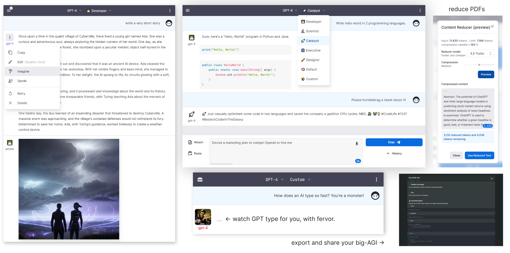

# `BIG-AGI` 🤖💬

Welcome to `big-AGI` 👋 your personal AGI application
powered by OpenAI GPT-4 and beyond. Designed for smart humans and super-heroes,
this responsive web app comes with Personas, Drawing, Code Execution, PDF imports, Voice support,
data Rendering, AGI functions, chats and much more. Comes with plenty of `#big-AGI-energy` 🚀

[](https://big-agi.com)

Or fork & run on Vercel

[](https://vercel.com/new/clone?repository-url=https%3A%2F%2Fgithub.com%2Fenricoros%2Fbig-agi&env=OPENAI_API_KEY,OPENAI_API_HOST&envDescription=OpenAI%20KEY%20for%20your%20deployment.%20Set%20HOST%20only%20if%20non-default.)

## ✨ Key Features 👊


- **AI Personas**
- **Polished UI**: installable web app, mobile-friendly, token counters, etc.
- **Fast UX**: Microphone, Camera OCR, Drag files, Voice Synthesis
- **Models**: [OpenAI](https://platform.openai.com/overview), [Anthropic](https://www.anthropic.com/product), [Azure](https://oai.azure.com/), [OpenRouter](https://openrouter.ai/), [Local models](https://github.com/oobabooga/text-generation-webui), and more
- **Private**: use your own API keys and self-host if you like
- **Advanced**: PDF import & Summarization, code execution
- **Integrations**: ElevenLabs, Helicone, Paste.gg, Prodia and more

## 💖 Support

[//]: # ([![Official Discord]&#40;https://img.shields.io/discord/1098796266906980422?label=discord&logo=discord&logoColor=%23fff&style=for-the-badge&#41;]&#40;https://discord.gg/MkH4qj2Jp9&#41;)
[](https://discord.gg/MkH4qj2Jp9)

* Enjoy the hosted open-source app on [big-AGI.com](https://big-agi.com)
* [Chat with us](https://discord.gg/MkH4qj2Jp9)
* Deploy your [fork](https://github.com/enricoros/big-agi/fork) for your friends and family
* send PRs! ...
  🎭[Editing Personas](https://github.com/enricoros/big-agi/issues/35),
  🧩[Reasoning Systems](https://github.com/enricoros/big-agi/issues/36),
  🌐[Community Templates](https://github.com/enricoros/big-agi/issues/35),
  and [your big-IDEAs](https://github.com/enricoros/big-agi/issues/new?labels=RFC&body=Describe+the+idea)

<br/>

## 🧠 Latest Drops

#### Next

- **Cloudflare API Gateway** support
- **Helicone for Anthropic** support
- **Text Tools** - incl. highlight differences

#### 1.4.0: Sept/Oct: scale OUT

- **Expanded Model Support**: Azure and [OpenRouter](https://openrouter.ai/docs#models) models, including gpt-4-32k
- **Share and clone** conversations with public links
- Removed the 20 chats hard limit ([Ashesh3](https://github.com/enricoros/big-agi/pull/158))
- Latex Rendering
- Augmented Chat modes (Labs)

#### July/Aug: More Better Faster

- **Camera OCR** - real-world AI - take a picture of a text, and chat with it
- **Anthropic models** support, e.g. Claude
- **Backup/Restore** - save chats, and restore them later
- **[Local model support with Oobabooga server](docs/config-local-oobabooga)** - run your own LLMs!
- **Flatten conversations** - conversations summarizer with 4 modes
- **Fork conversations** - create a new chat, to experiment with different endings
- New commands: /s to add a System message, and /a for an Assistant message
- New Chat modes: Write-only - just appends the message, without assistant response
- Fix STOP generation - in sync with the Vercel team to fix a long-standing NextJS issue
- Fixes on the HTML block - particularly useful to see error pages

#### June: scale UP

- **[New OpenAI Models](https://openai.com/blog/function-calling-and-other-api-updates) support** - 0613 models, including 16k and 32k
- **Cleaner UI** - with rationalized Settings, Modals, and Configurators
- **Dynamic Models Configurator** - easy connection with different model vendors
- **Multiple Model Vendors Support** framework to support many LLM vendors
- **Per-model Options** (temperature, tokens, etc.) for fine-tuning AI behavior to your needs
- Support for GPT-4-32k
- Improved Dialogs and Messages
- Much Enhanced DX: TRPC integration, modularization, pluggable UI, etc

#### April / May: more #big-agi-energy

- **[Google Search](docs/pixels/feature_react_google.png)** active in ReAct - add your keys to Settings > Google
  Search
- **[Reason+Act](docs/pixels/feature_react_turn_on.png)** preview feature - activate with 2-taps on the 'Chat' button
- **[Image Generation](docs/pixels/feature_imagine_command.png)** using Prodia (BYO Keys) - /imagine - or menu option
- **[Voice Synthesis](docs/pixels/feature_voice_1.png)** 📣 with ElevenLabs, including selection of custom voices
- **[Precise Token Counter](docs/pixels/feature_token_counter.png)** 📈 extra-useful to pack the context window
- **[Install Mobile APP](docs/pixels/feature_pwa.png)** 📲 looks like native (@harlanlewis)
- **[UI language](docs/pixels/feature_language.png)** with auto-detect, and future app language! (@tbodyston)
- **PDF Summarization** 🧩🤯 - ask questions to a PDF! (@fredliubojin)
- **Code Execution: [Codepen](https://codepen.io/)/[Replit](https://replit.com/)** 💻 (@harlanlewis)
- **[SVG Drawing](docs/pixels/feature_svg_drawing.png)** - draw with AI 🎨
- Chats: multiple chats, AI titles, Import/Export, Selection mode
- Rendering: Markdown, SVG, improved Code blocks
- Integrations: OpenAI organization ID
- [Cloudflare deployment instructions](docs/deploy-cloudflare.md),
  [awesome-agi](https://github.com/enricoros/awesome-agi)
- [Typing Avatars](docs/pixels/gif_typing_040123.gif) ⌨️
  <!-- p><a href="docs/pixels/gif_typing_040123.gif"></a></p -->

#### March: first release

- **[AI Personas](docs/pixels/feature_purpose_two.png)** - including Code, Science, Corporate, and Chat 🎭
- **Privacy**: user-owned API keys 🔑 and localStorage 🛡️
- **Context** - Attach or [Drag & Drop files](docs/pixels/feature_drop_target.png) to add them to the prompt 📁
- **Syntax highlighting** - for multiple languages 🌈
- **Code Execution: Sandpack** -
  [now on branch]((https://github.com/enricoros/big-agi/commit/f678a0d463d5e9cf0733f577e11bd612b7902d89)) `variant-code-execution`
- Chat with GPT-4 and 3.5 Turbo 🧠💨
- Real-time streaming of AI responses ⚡
- **Voice Input** 🎙️ - works great on Chrome / Windows
- Integration: **[Paste.gg](docs/pixels/feature_paste_gg.png)** integration for chat sharing 📥
- Integration: **[Helicone](https://www.helicone.ai/)** integration for API observability 📊
- 🌙 Dark model - Wide mode ⛶

<br/>

## Why this? 💡

Because the official Chat ___lacks important features___, is ___more limited than the api___, at times
___slow or unavailable___, and you cannot deploy it yourself, remix it, add features, or share it with
your friends.
Our users report that ___big-AGI is faster___, ___more reliable___, and ___features rich___
with features that matter to them.



## Develop 🧩


Clone this repo, install the dependencies, and run the development server:

```bash
git clone https://github.com/enricoros/big-agi.git
cd big-agi
npm install
npm run dev
```

Now the app should be running on `http://localhost:3000`

### Integrations:

* [ElevenLabs](https://elevenlabs.io/) Voice Synthesis (bring your own voice too) - Settings > Text To Speech
* [Helicone](https://www.helicone.ai/) LLM Observability Platform - Models > OpenAI > Advanced > API Host: 'oai.hconeai.com'
* [Paste.gg](https://paste.gg/) Paste Sharing - Chat Menu > Share via paste.gg
* [Prodia](https://prodia.com/) Image Generation - Settings > Image Generation > Api Key & Model

## Deploy with Docker 🐳

For more detailed information on deploying with Docker, please refer to the [docker deployment documentation](docs/deploy-docker.md).

### 🔧 Locally built image

> Firstly, write all your API keys and env vars to an `.env` file, and make sure the env file is using *both build and run*.
> See [docs/environment-variables.md](docs/environment-variables.md) for a list of all environment variables.

```bash

```bash
docker build -t big-agi .
docker run --detach 'big-agi'
``` 

### Pre-built image

> Warning: the UI will still be asking for keys, as the image was built without the API keys

```bash
docker-compose up
```

## Deploy with Cloudflare Pages ☁️

Please refer to the [Cloudflare deployment documentation](docs/deploy-cloudflare.md).

## Deploy with Vercel 🚀

Create your GitHub fork, create a Vercel project over that fork, and deploy it. Or press the button below for convenience.

[](https://vercel.com/new/clone?repository-url=https%3A%2F%2Fgithub.com%2Fenricoros%2Fbig-agi&env=OPENAI_API_KEY,OPENAI_API_HOST&envDescription=OpenAI%20KEY%20for%20your%20deployment.%20Set%20HOST%20only%20if%20non-default.)


<br/>

This project is licensed under the MIT License.

[](https://github.com/enricoros/big-agi/stargazers)
[](https://github.com/enricoros/big-agi/network)
[](https://github.com/enricoros/big-agi/pulls)
[](https://github.com/enricoros/big-agi/LICENSE)

[//]: # ([![GitHub issues]&#40;https://img.shields.io/github/issues/enricoros/big-agi&#41;]&#40;https://github.com/enricoros/big-agi/issues&#41;)

Made with 💙
