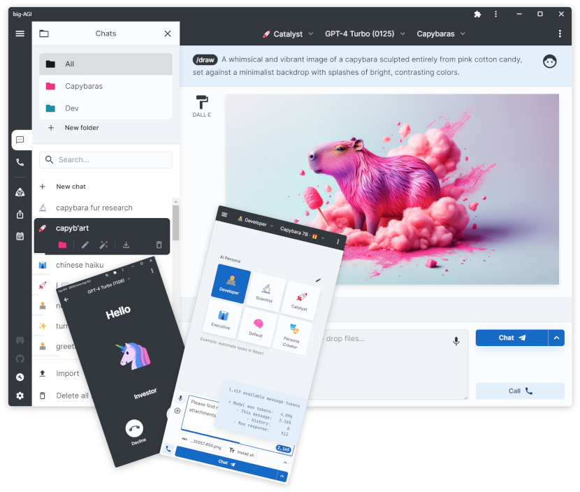

# Big-AGI Open 🧠

This is the open-source foundation for **Big-AGI**.

Big-AGI is the multi-model AI workspace for experts who need to think broader, decide smarter, and build with confidence.
It comes packed with **world-class features** like Beam, and is praised for its **best-in-class AI chat UX**.

**What makes Big-AGI different:**  
**Intelligence**, with [Beam](https://big-agi.com/beam) & Merge for multi-model reasoning and bleeding-edge AI models like Nano Banana, GPT-5 Pro, Sonnet 4.5 - 
**Control** with personas, data ownership, requests inspection, unlimited usage with API keys, and *no vendor lock-in* - 
and **Speed** with a local-first, over-powered, zero-latency, madly optimized web app.

**Who uses Big-AGI:**  
Loved by engineers, founders, researchers, self-hosters, and IT departments for its power, reliability, and transparency.

Choose Big-AGI because you don't need another clone or slop - you need an AI tool that scales with you.

## Get Started

**Most users: [big-agi.com](https://big-agi.com)** (fastest, zero setup, support the project)  
Free tier with all core features and more, Pro tier with Cloud Sync.

  

**Self-host and developers** (full control)  
Develop locally or self-host with Docker on your own infrastructure – [guide](docs/installation.md)  

Or fork & run on Vercel:

[//]: # (**For the latest Big-AGI:**)

[//]: # (- [**Big-AGI Open**]&#40;https://github.com/enricoros/big-AGI/tree/main&#41; - Open Source, latest models and features &#40;main branch&#41;)

[//]: # (- [**Big-AGI Pro**]&#40;https://big-agi.com&#41; - Hosted with Cloud Sync)

---

## What's New in 2.0 · Oct 6, 2025 · Open

- **Big-AGI Open** is ready and more productive and faster than ever, with:
- **Beam 2**: multi-modal, program-based, follow-ups, save presets
- Top-notch AI models support including **agentic models** and **reasoning models**
- **Image Generation** and editing with Nano Banana and gpt-image-1
- **Web Search** with citations for supported models
- **UI** & Mobile UI overhaul with peeking and side panels
- And all of the [Big-AGI 2 changes](https://github.com/enricoros/big-AGI/issues/567#issuecomment-2262187617) and more
- Built for the future, madly optimized

### Open links: 👉 [installation](docs/installation.md) 👉 [roadmap](https://github.com/users/enricoros/projects/4/views/2) 👉 [documentation](docs/README.md)

5,000 Commits Milestone

Hit 5k commits last week. That's a lot of code.

Recent work has been intense:
- Chain of thought reasoning across multiple LLMs: **OpenAI o3** and o1, **DeepSeek R1**, **Gemini 2.0 Flash Thinking**, and more
- Beam is real - ~35% of our users run it daily to compare models
- New AIX framework lets us scale features we couldn't before
- UI is faster than ever. Like, terminal-fast

The new architecture is solid and the speed improvements are real.

What's New in 1.16.1...1.16.10 · 2024-2025 (patch releases)

- 1.16.10: OpenRouter models support
- 1.16.9: Docker Gemini fix, R1 models support
- 1.16.8: OpenAI ChatGPT-4o Latest, o1 models support
- 1.16.7: OpenAI support for GPT-4o 2024-08-06
- 1.16.6: Groq support for Llama 3.1 models
- 1.16.5: GPT-4o Mini support
- 1.16.4: 8192 tokens support for Claude 3.5 Sonnet
- 1.16.3: Anthropic Claude 3.5 Sonnet model support
- 1.16.2: Improve web downloads, as text, markdown, or HTML
- 1.16.2: Proper support for Gemini models
- 1.16.2: Added the latest Mistral model
- 1.16.2: Tokenizer support for gpt-4o
- 1.16.2: Updates to Beam
- 1.16.1: Support for the new OpenAI GPT-4o 2024-05-13 model

What's New in 1.16.0 · May 9, 2024 · Crystal Clear

- [Beam](https://big-agi.com/blog/beam-multi-model-ai-reasoning) core and UX improvements based on user feedback
- Chat cost estimation 💰 (enable it in Labs / hover the token counter)
- Save/load chat files with Ctrl+S / Ctrl+O on desktop
- Major enhancements to the Auto-Diagrams tool
- YouTube Transcriber Persona for chatting with video content, [#500](https://github.com/enricoros/big-AGI/pull/500)
- Improved formula rendering (LaTeX), and dark-mode diagrams, [#508](https://github.com/enricoros/big-AGI/issues/508), [#520](https://github.com/enricoros/big-AGI/issues/520)
- Models update: **Anthropic**, **Groq**, **Ollama**, **OpenAI**, **OpenRouter**, **Perplexity**
- Code soft-wrap, chat text selection toolbar, 3x faster on Apple silicon, and more [#517](https://github.com/enricoros/big-AGI/issues/517), [507](https://github.com/enricoros/big-AGI/pull/507)

3,000 Commits Milestone · April 7, 2024

- 🥇 Today we <b>celebrate commit 3000</b> in just over one year, and going stronger 🚀
- 📢️ Thanks everyone for your support and words of love for Big-AGI, we are committed to creating the best AI experiences for everyone.

What's New in 1.15.0 · April 1, 2024 · Beam

- ⚠️ [**Beam**: the multi-model AI chat](https://big-agi.com/blog/beam-multi-model-ai-reasoning). find better answers, faster - a game-changer for brainstorming, decision-making, and creativity. [#443](https://github.com/enricoros/big-AGI/issues/443)
- Managed Deployments **Auto-Configuration**: simplify the UI models setup with backend-set models. [#436](https://github.com/enricoros/big-AGI/issues/436)
- Message **Starring ⭐**: star important messages within chats, to attach them later. [#476](https://github.com/enricoros/big-AGI/issues/476)
- Enhanced the default Persona
- Fixes to Gemini models and SVGs, improvements to UI and icons
- 1.15.1: Support for Gemini Pro 1.5 and OpenAI Turbo models
- Beast release, over 430 commits, 10,000+ lines changed: [release notes](https://github.com/enricoros/big-AGI/releases/tag/v1.15.0), and changes [v1.14.1...v1.15.0](https://github.com/enricoros/big-AGI/compare/v1.14.1...v1.15.0)

What's New in 1.14.1 · March 7, 2024 · Modelmorphic

- **Anthropic** [Claude-3](https://www.anthropic.com/news/claude-3-family) model family support. [#443](https://github.com/enricoros/big-AGI/issues/443)
- New **[Perplexity](https://www.perplexity.ai/)** and **[Groq](https://groq.com/)** integration (thanks @Penagwin). [#407](https://github.com/enricoros/big-AGI/issues/407), [#427](https://github.com/enricoros/big-AGI/issues/427)
- **[LocalAI](https://localai.io/models/)** deep integration, including support for [model galleries](https://github.com/enricoros/big-AGI/issues/411)
- **Mistral** Large and Google **Gemini 1.5** support
- Performance optimizations: runs [much faster](https://twitter.com/enricoros/status/1756553038293303434?utm_source=localhost:3000&utm_medium=big-agi), saves lots of power, reduces memory usage
- Enhanced UX with auto-sizing charts, refined search and folder functionalities, perfected scaling
- And with more UI improvements, documentation, bug fixes (20 tickets), and developer enhancements

What's New in 1.13.0 · Feb 8, 2024 · Multi + Mind

https://github.com/enricoros/big-AGI/assets/32999/01732528-730e-41dc-adc7-511385686b13

- **Side-by-Side Split Windows**: multitask with parallel conversations. [#208](https://github.com/enricoros/big-AGI/issues/208)
- **Multi-Chat Mode**: message everyone, all at once. [#388](https://github.com/enricoros/big-AGI/issues/388)
- **Export tables as CSV**: big thanks to @aj47. [#392](https://github.com/enricoros/big-AGI/pull/392)
- Adjustable text size: customize density. [#399](https://github.com/enricoros/big-AGI/issues/399)
- Dev2 Persona Technology Preview
- Better looking chats with improved spacing, fonts, and menus
- More: new video player, [LM Studio tutorial](https://github.com/enricoros/big-AGI/blob/main/docs/config-local-lmstudio.md) (thanks @aj47), [MongoDB support](https://github.com/enricoros/big-AGI/blob/main/docs/deploy-database.md) (thanks @ranfysvalle02), and speedups

What's New in 1.12.0 · Jan 26, 2024 · AGI Hotline

https://github.com/enricoros/big-AGI/assets/32999/95ceb03c-945d-4fdd-9a9f-3317beb54f3f

- **Voice Calls**: real-time voice call your personas out of the blue or in relation to a chat [#354](https://github.com/enricoros/big-AGI/issues/354)
- Support **OpenAI 0125** Models. [#364](https://github.com/enricoros/big-AGI/issues/364)
- Rename or Auto-Rename chats.  [#222](https://github.com/enricoros/big-AGI/issues/222), [#360](https://github.com/enricoros/big-AGI/issues/360)
- More control over **Link Sharing** [#356](https://github.com/enricoros/big-AGI/issues/356)
- **Accessibility** to screen readers [#358](https://github.com/enricoros/big-AGI/issues/358)
- Export chats to Markdown [#337](https://github.com/enricoros/big-AGI/issues/337)
- Paste tables from Excel [#286](https://github.com/enricoros/big-AGI/issues/286)
- Ollama model updates and context window detection fixes [#309](https://github.com/enricoros/big-AGI/issues/309)

What's New in 1.11.0 · Jan 16, 2024 · Singularity

https://github.com/enricoros/big-AGI/assets/1590910/a6b8e172-0726-4b03-a5e5-10cfcb110c68

- **Find chats**: search in titles and content, with frequency ranking. [#329](https://github.com/enricoros/big-AGI/issues/329)
- **Commands**: command auto-completion (type '/'). [#327](https://github.com/enricoros/big-AGI/issues/327)
- **[Together AI](https://www.together.ai/products#inference)** inference platform support (good speed and newer models). [#346](https://github.com/enricoros/big-AGI/issues/346)
- Persona Creator history, deletion, custom creation, fix llm API timeouts
- Enable adding up to five custom OpenAI-compatible endpoints
- Developer enhancements: new 'Actiles' framework

What's New in 1.10.0 · Jan 6, 2024 · The Year of AGI

- **New UI**: for both desktop and mobile, sets the stage for future scale. [#201](https://github.com/enricoros/big-AGI/issues/201)
- **Conversation Folders**: enhanced conversation organization. [#321](https://github.com/enricoros/big-AGI/issues/321)
- **[LM Studio](https://lmstudio.ai/)** support and improved token management
- Resizable panes in split-screen conversations.
- Large performance optimizations
- Developer enhancements: new UI framework, updated documentation for proxy settings on browserless/docker

For full details and former releases, check out the [changelog](docs/changelog.md).

## 👉 Key Features

|  |  |  |  |  |  
|---------------------------------------------------------------------------------------------------------------|-------------------------------------------------------------------------------------------------------------------------|----------------------------------------------------------------------------------------------------------------------|------------------------------------------------------------------------------------------------------------------------|----------------------------------------------------------------------------------------------------------------------| 
| **Chat** **Call** **Beam** **Draw**, ...                                                          | Local & Cloud Open & Closed Cheap & Heavy Google, Mistral, ...                                              | Attachments Diagrams Multi-Chat Mobile-first UI                                                          | Stored Locally Easy self-Host Local actions Data = Gold                                                    | AI Personas Voice Modes Screen Capture Camera + OCR                                                      |

You can easily configure 100s of AI models in big-AGI:

| **AI models**       | _supported vendors_                                                                                                                                                                                                                                                                                               |
|:--------------------|:------------------------------------------------------------------------------------------------------------------------------------------------------------------------------------------------------------------------------------------------------------------------------------------------------------------|
| Opensource Servers  | [LocalAI](https://localai.io/) (multimodal) · [Ollama](https://ollama.com/)                                                                                                                                                                                                                                       |
| Local Servers       | [LM Studio](https://lmstudio.ai/)                                                                                                                                                                                                                                                                                 |
| Multimodal services | [Azure](https://azure.microsoft.com/en-us/products/ai-services/openai-service) · [Anthropic](https://anthropic.com) · [Google Gemini](https://ai.google.dev/) · [OpenAI](https://platform.openai.com/docs/overview)                                                                                               |
| Language services   | [Alibaba](https://www.alibabacloud.com/en/product/modelstudio) · [DeepSeek](https://deepseek.com) · [Groq](https://wow.groq.com/) · [Mistral](https://mistral.ai/) · [OpenRouter](https://openrouter.ai/) · [Perplexity](https://www.perplexity.ai/) · [Together AI](https://www.together.ai/) · [xAI](https://x.ai/) |
| Image services      | OpenAI · Google Gemini                                                                                                                                                                                                                                                                                            |
| Speech services     | [ElevenLabs](https://elevenlabs.io) (Voice synthesis / cloning)                                                                                                                                                                                                                                                   | 

Add extra functionality with these integrations:

| **More**     | _integrations_                                                                                                 |
|:-------------|:---------------------------------------------------------------------------------------------------------------| 
| Web Browse   | [Browserless](https://www.browserless.io/) · [Puppeteer](https://pptr.dev/)-based                              |
| Web Search   | [Google CSE](https://programmablesearchengine.google.com/)                                                     |
| Code Editors | [CodePen](https://codepen.io/pen/) · [StackBlitz](https://stackblitz.com/) · [JSFiddle](https://jsfiddle.net/) |
| Tracking     | [Helicone](https://www.helicone.ai) (LLM Observability)                                                        | 

[//]: # (- [x] **Flow-state UX** for uncompromised productivity)

[//]: # (- [x] **AI Personas**: Tailor your AI interactions with customizable personas)

[//]: # (- [x] **Sleek UI/UX**: A smooth, intuitive, and mobile-responsive interface)

[//]: # (- [x] **Efficient Interaction**: Voice commands, OCR, and drag-and-drop file uploads)

[//]: # (- [x] **Privacy First**: Self-host and use your own API keys for full control)

[//]: # (- [x] **Advanced Tools**: Execute code, import PDFs, and summarize documents)

[//]: # (- [x] **Seamless Integrations**: Enhance functionality with various third-party services)

[//]: # (- [x] **Open Roadmap**: Contribute to the progress of big-AGI)

 

## 🚀 Installation

To get started with big-AGI, follow our comprehensive [Installation Guide](docs/installation.md).
The guide covers various installation options, whether you're spinning it up on
your local computer, deploying on Vercel, on Cloudflare, or rolling it out
through Docker.

Whether you're a developer, system integrator, or enterprise user, you'll find step-by-step instructions
to set up big-AGI quickly and easily.

Or bring your API keys and jump straight into our free instance on [big-AGI.com](https://big-agi.com).

 

# 🌟 Get Involved!

[//]: # ([![Official Discord]&#40;https://img.shields.io/discord/1098796266906980422?label=discord&logo=discord&logoColor=%23fff&style=for-the-badge&#41;]&#40;https://discord.gg/MkH4qj2Jp9&#41;)

- [ ] 📢️ [**Chat with us** on Discord](https://discord.gg/MkH4qj2Jp9)
- [ ] ⭐ **Give us a star** on GitHub 👆
- [ ] 🚀 **Do you like code**? You'll love this gem of a project! [_Pick up a task!_](https://github.com/users/enricoros/projects/4/views/4) - _easy_ to _pro_
- [ ] 💡 Got a feature suggestion? [_Add your roadmap ideas_](https://github.com/enricoros/big-agi/issues/new?&template=roadmap-request.md)
- [ ] ✨ [Deploy](docs/installation.md) your [fork](docs/customizations.md) for your friends and family, or [customize it for work](docs/customizations.md)

 

[//]: # ([![GitHub stars]&#40;https://img.shields.io/github/stars/enricoros/big-agi&#41;]&#40;https://github.com/enricoros/big-agi/stargazers&#41;)

[//]: # ([![GitHub forks]&#40;https://img.shields.io/github/forks/enricoros/big-agi&#41;]&#40;https://github.com/enricoros/big-agi/network&#41;)

[//]: # ([![GitHub pull requests]&#40;https://img.shields.io/github/issues-pr/enricoros/big-agi&#41;]&#40;https://github.com/enricoros/big-agi/pulls&#41;)

[//]: # ([![License]&#40;https://img.shields.io/github/license/enricoros/big-agi&#41;]&#40;https://github.com/enricoros/big-agi/LICENSE&#41;)

## 📜 Licensing

Big-AGI incorporates third-party software components that are subject
to separate license terms. For detailed information about these
components and their respective licenses, please refer to
the [Third-Party Notices](src/modules/3rdparty/THIRD_PARTY_NOTICES.md).

---

2023-2025 · Enrico Ros x [Big-AGI](https://big-agi.com) · Like this project? Leave a star! 💫⭐
