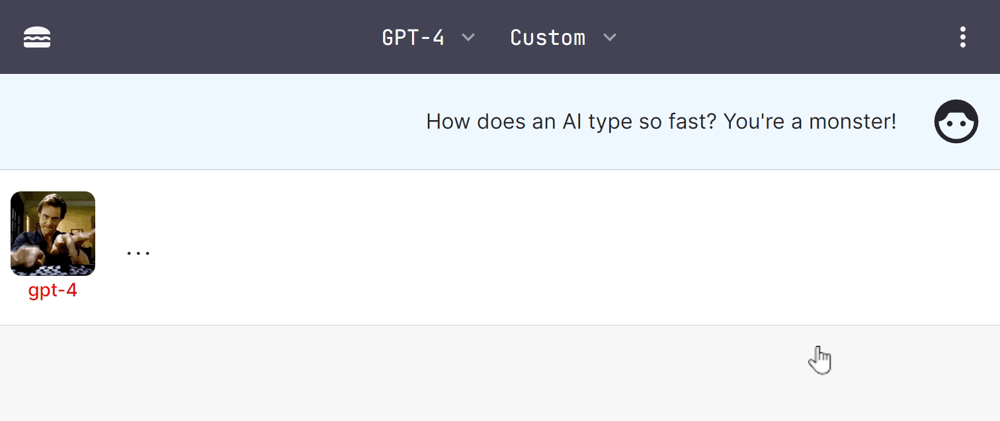

## Changelog

This is a high-level changelog. Calls out some of the high level features batched
by release.

- For the live roadmap, please see [the GitHub project](https://github.com/users/enricoros/projects/4/views/2)

### 1.17.0 - Jun 2024

- milestone: [1.17.0](https://github.com/enricoros/big-agi/milestone/17)
- work in progress: [big-AGI open roadmap](https://github.com/users/enricoros/projects/4/views/2), [help here](https://github.com/users/enricoros/projects/4/views/4)

### What's New in 1.16.1...1.16.8 · Sep 13, 2024 (patch releases)

- 1.16.8: OpenAI ChatGPT-4o Latest (o1-preview and o1-mini are supported in Big-AGI 2)
- 1.16.7: OpenAI support for GPT-4o 2024-08-06
- 1.16.6: Groq support for Llama 3.1 models
- 1.16.5: GPT-4o Mini support
- 1.16.4: 8192 tokens support for Claude 3.5 Sonnet
- 1.16.3: Anthropic Claude 3.5 Sonnet model support
- 1.16.2: Improve web downloads, as text, markdown, or HTML
- 1.16.2: Proper support for Gemini models
- 1.16.2: Added the latest Mistral model
- 1.16.2: Tokenizer support for gpt-4o
- 1.16.2: Updates to Beam
- 1.16.1: Support for the new OpenAI GPT-4o 2024-05-13 model

### What's New in 1.16.0 · May 9, 2024 · Crystal Clear

- [Beam](https://big-agi.com/blog/beam-multi-model-ai-reasoning) core and UX improvements based on user feedback
- Chat cost estimation 💰 (enable it in Labs / hover the token counter)
- Save/load chat files with Ctrl+S / Ctrl+O on desktop
- Major enhancements to the Auto-Diagrams tool
- YouTube Transcriber Persona for chatting with video content, [#500](https://github.com/enricoros/big-AGI/pull/500)
- Improved formula rendering (LaTeX), and dark-mode diagrams, [#508](https://github.com/enricoros/big-AGI/issues/508), [#520](https://github.com/enricoros/big-AGI/issues/520)
- Models update: **Anthropic**, **Groq**, **Ollama**, **OpenAI**, **OpenRouter**, **Perplexity**
- Code soft-wrap, chat text selection toolbar, 3x faster on Apple silicon, and more [#517](https://github.com/enricoros/big-AGI/issues/517), [507](https://github.com/enricoros/big-AGI/pull/507)
- Developers: update the LLMs data structures

### What's New in 1.15.1 · April 10, 2024 (minor release, models support)

- Support for the newly released Gemini Pro 1.5 models
- Support for the new OpenAI 2024-04-09 Turbo models
- Resilience fixes after the large success of 1.15.0

### What's New in 1.15.0 · April 1, 2024 · Beam

- ⚠️ [**Beam**: the multi-model AI chat](https://big-agi.com/blog/beam-multi-model-ai-reasoning). find better answers, faster - a game-changer for brainstorming, decision-making, and creativity. [#443](https://github.com/enricoros/big-AGI/issues/443)
- Managed Deployments **Auto-Configuration**: simplify the UI mdoels setup with backend-set models. [#436](https://github.com/enricoros/big-AGI/issues/436)
- Message **Starring ⭐**: star important messages within chats, to attach them later. [#476](https://github.com/enricoros/big-AGI/issues/476)
- Enhanced the default Persona
- Fixes to Gemini models and SVGs, improvements to UI and icons
- Beast release, over 430 commits, 10,000+ lines changed: [release notes](https://github.com/enricoros/big-AGI/releases/tag/v1.15.0), and changes [v1.14.1...v1.15.0](https://github.com/enricoros/big-AGI/compare/v1.14.1...v1.15.0)

### What's New in 1.14.1 · March 7, 2024 · Modelmorphic

- **Anthropic** [Claude-3](https://www.anthropic.com/news/claude-3-family) model family support. [#443](https://github.com/enricoros/big-AGI/issues/443)
- New **[Perplexity](https://www.perplexity.ai/)** and **[Groq](https://groq.com/)** integration (thanks @Penagwin). [#407](https://github.com/enricoros/big-AGI/issues/407), [#427](https://github.com/enricoros/big-AGI/issues/427)
- **[LocalAI](https://localai.io/models/)** deep integration, including support for [model galleries](https://github.com/enricoros/big-AGI/issues/411)
- **Mistral** Large and Google **Gemini 1.5** support
- Performance optimizations: runs [much faster](https://twitter.com/enricoros/status/1756553038293303434?utm_source=localhost:3000&utm_medium=big-agi), saves lots of power, reduces memory usage
- Enhanced UX with auto-sizing charts, refined search and folder functionalities, perfected scaling
- And with more UI improvements, documentation, bug fixes (20 tickets), and developer enhancements
- [Release notes](https://github.com/enricoros/big-AGI/releases/tag/v1.14.0), and changes [v1.13.1...v1.14.0](https://github.com/enricoros/big-AGI/compare/v1.13.1...v1.14.0) (233 commits, 8,000+ lines changed)

### What's New in 1.13.0 · Feb 8, 2024 · Multi + Mind

https://github.com/enricoros/big-AGI/assets/32999/01732528-730e-41dc-adc7-511385686b13

- **Side-by-Side Split Windows**: multitask with parallel conversations. [#208](https://github.com/enricoros/big-AGI/issues/208)
- **Multi-Chat Mode**: message everyone, all at once. [#388](https://github.com/enricoros/big-AGI/issues/388)
- **Export tables as CSV**: big thanks to @aj47. [#392](https://github.com/enricoros/big-AGI/pull/392)
- Adjustable text size: customize density. [#399](https://github.com/enricoros/big-AGI/issues/399)
- Dev2 Persona Technology Preview
- Better looking chats with improved spacing, fonts, and menus
- More: new video player, [LM Studio tutorial](https://github.com/enricoros/big-AGI/blob/main/docs/config-local-lmstudio.md) (thanks @aj47), [MongoDB support](https://github.com/enricoros/big-AGI/blob/main/docs/deploy-database.md) (thanks @ranfysvalle02), and speedups

### What's New in 1.12.0 · Jan 26, 2024 · AGI Hotline

https://github.com/enricoros/big-AGI/assets/32999/95ceb03c-945d-4fdd-9a9f-3317beb54f3f

- **Voice Calls**: real-time voice call your personas out of the blue or in relation to a chat [#354](https://github.com/enricoros/big-AGI/issues/354)
- Support **OpenAI 0125** Models. [#364](https://github.com/enricoros/big-AGI/issues/364)
- Rename or Auto-Rename chats.  [#222](https://github.com/enricoros/big-AGI/issues/222), [#360](https://github.com/enricoros/big-AGI/issues/360)
- More control over **Link Sharing** [#356](https://github.com/enricoros/big-AGI/issues/356)
- **Accessibility** to screen readers [#358](https://github.com/enricoros/big-AGI/issues/358)
- Export chats to Markdown [#337](https://github.com/enricoros/big-AGI/issues/337)
- Paste tables from Excel [#286](https://github.com/enricoros/big-AGI/issues/286)
- Ollama model updates and context window detection fixes [#309](https://github.com/enricoros/big-AGI/issues/309)

### What's New in 1.11.0 · Jan 16, 2024 · Singularity

https://github.com/enricoros/big-AGI/assets/1590910/a6b8e172-0726-4b03-a5e5-10cfcb110c68

- **Find chats**: search in titles and content, with frequency ranking. [#329](https://github.com/enricoros/big-AGI/issues/329)
- **Commands**: command auto-completion (type '/'). [#327](https://github.com/enricoros/big-AGI/issues/327)
- **[Together AI](https://www.together.ai/products#inference)** inference platform support (good speed and newer models). [#346](https://github.com/enricoros/big-AGI/issues/346)
- Persona Creator history, deletion, custom creation, fix llm API timeouts
- Enable adding up to five custom OpenAI-compatible endpoints
- Developer enhancements: new 'Actiles' framework

### What's New in 1.10.0 · Jan 6, 2024 · The Year of AGI

- **New UI**: for both desktop and mobile, sets the stage for future scale. [#201](https://github.com/enricoros/big-AGI/issues/201)
- **Conversation Folders**: enhanced conversation organization. [#321](https://github.com/enricoros/big-AGI/issues/321)
- **[LM Studio](https://lmstudio.ai/)** support and improved token management
- Resizable panes in split-screen conversations.
- Large performance optimizations
- Developer enhancements: new UI framework, updated documentation for proxy settings on browserless/docker

### What's New in 1.9.0 · Dec 28, 2023 · Creative Horizons

- **DALL·E 3 integration** for enhanced image generation. [#212](https://github.com/enricoros/big-AGI/issues/212)
- **Perfect scrolling mechanics** across devices. [#304](https://github.com/enricoros/big-AGI/issues/304)
- Persona creation now supports **text input**. [#287](https://github.com/enricoros/big-AGI/pull/287)
- Openrouter updates for better model management and rate limit handling
- Image drawing UX improvements
- Layout fix for Firefox users
- Developer enhancements: Text2Image subsystem, Optima layout, ScrollToBottom library, Panes library, and Llms subsystem updates.

### What's New in 1.8.0 · Dec 20, 2023 · To The Moon And Back

- **Google Gemini Support**: Use the newest Google models. [#275](https://github.com/enricoros/big-agi/issues/275)
- **Mistral Platform**: Mixtral and future models support. [#273](https://github.com/enricoros/big-agi/issues/273)
- **Diagram Instructions**. Thanks to @joriskalz! [#280](https://github.com/enricoros/big-agi/pull/280)
- Ollama Chats: Enhanced chatting experience. [#270](https://github.com/enricoros/big-agi/issues/270)
- Mac Shortcuts Fix: Improved UX on Mac
- **Single-Tab Mode**: Data integrity with single window. [#268](https://github.com/enricoros/big-agi/issues/268)
- **Updated Models**: Latest Ollama (v0.1.17) and OpenRouter models
- Official Downloads: Easy access to the latest big-AGI on [big-AGI.com](https://big-agi.com)
- For developers: [troubleshot networking](https://github.com/enricoros/big-AGI/issues/276#issuecomment-1858591483), fixed Vercel deployment, cleaned up the LLMs/Streaming framework

### What's New in 1.7.0 · Dec 11, 2023 · Attachment Theory

- **Attachments System Overhaul**: Drag, paste, link, snap, text, images, PDFs and more. [#251](https://github.com/enricoros/big-agi/issues/251)
- **Desktop Webcam Capture**: Image capture now available as Labs feature. [#253](https://github.com/enricoros/big-agi/issues/253)
- **Independent Browsing**: Full browsing support with Browserless. [Learn More](https://github.com/enricoros/big-agi/blob/main/docs/config-feature-browse.md)
- **Overheat LLMs**: Push the creativity with higher LLM temperatures. [#256](https://github.com/enricoros/big-agi/issues/256)
- **Model Options Shortcut**: Quick adjust with `Ctrl+Shift+O`
- Optimized Voice Input and Performance
- Latest Ollama models
- For developers: **Password Protection**: HTTP Basic Auth. [Learn How](https://github.com/enricoros/big-agi/blob/main/docs/deploy-authentication.md)

### What's New in 1.6.0 - Nov 28, 2023 · Surf's Up

- **Web Browsing**: Download web pages within chats - [browsing guide](https://github.com/enricoros/big-agi/blob/main/docs/config-feature-browse.md)
- **Branching Discussions**: Create new conversations from any message
- **Keyboard Navigation**: Swift chat navigation with new shortcuts (e.g. ctrl+alt+left/right)
- **Performance Boost**: Faster rendering for a smoother experience
- **UI Enhancements**: Refined interface based on user feedback
- **New Features**: Anthropic Claude 2.1, `/help` command, and Flattener tool
- **For Developers**: Code quality upgrades and snackbar notifications

### What's New in 1.5.0 - Nov 19, 2023 · Loaded

- **Continued Voice**: Engage with hands-free interaction for a seamless experience
- **Visualization Tool**: Create data representations with our new visualization capabilities
- **Ollama Local Models**: Leverage local models support with our comprehensive guide
- **Text Tools**: Enjoy tools including highlight differences to refine your content
- **Mermaid Diagramming**: Render complex diagrams with our Mermaid language support
- **OpenAI 1106 Chat Models**: Experience the cutting-edge capabilities of the latest OpenAI models
- **SDXL Support**: Enhance your image generation with SDXL support for Prodia
- **Cloudflare OpenAI API Gateway**: Integrate with Cloudflare for a robust API gateway
- **Helicone for Anthropic**: Utilize Helicone's tools for Anthropic models

For Developers:

- Runtime Server-Side configuration:  https://github.com/enricoros/big-agi/issues/189. Env vars are
  not required to be set at build time anymore. The frontend will roundtrip to the backend at the
  first request to get the configuration. See
  https://github.com/enricoros/big-agi/blob/main/src/modules/backend/backend.router.ts.
- CloudFlare developers: please change the deployment command to
  `rm app/api/cloud/[trpc]/route.ts && npx @cloudflare/next-on-pages@1`,
  as we transitioned to the App router in NextJS 14. The documentation in
  [docs/deploy-cloudflare.md](../docs/deploy-cloudflare.md) is updated

### 1.4.0: Sept/Oct: scale OUT

- **Expanded Model Support**: Azure and [OpenRouter](https://openrouter.ai/docs#models) models, including gpt-4-32k
- **Share and clone** conversations with public links
- Removed the 20 chats hard limit ([Ashesh3](https://github.com/enricoros/big-agi/pull/158))
- Latex Rendering
- Augmented Chat modes (Labs)

### July/Aug: More Better Faster

- **Camera OCR** - real-world AI - take a picture of a text, and chat with it
- **Anthropic models** support, e.g. Claude
- **Backup/Restore** - save chats, and restore them later
- **Flatten conversations** - conversations summarizer with 4 modes
- **Fork conversations** - create a new chat, to try with different endings
- New commands: /s to add a System message, and /a for an Assistant message
- New Chat modes: Write-only - just appends the message, without assistant response
- Fix STOP generation - in sync with the Vercel team to fix a long-standing NextJS issue
- Fixes on the HTML block - particularly useful to see error pages

### June: scale UP

- **[New OpenAI Models](https://openai.com/blog/function-calling-and-other-api-updates) support** - 0613 models, including 16k and 32k
- **Cleaner UI** - with rationalized Settings, Modals, and Configurators
- **Dynamic Models Configurator** - easy connection with different model vendors
- **Multiple Model Vendors Support** framework to support many LLM vendors
- **Per-model Options** (temperature, tokens, etc.) for fine-tuning AI behavior to your needs
- Support for GPT-4-32k
- Improved Dialogs and Messages
- Much Enhanced DX: TRPC integration, modularization, pluggable UI, etc

### April / May: more #big-agi-energy

- **[Google Search](../docs/pixels/feature_react_google.png)** active in ReAct - add your keys to Settings > Google
  Search
- **[Reason+Act](../docs/pixels/feature_react_turn_on.png)** preview feature - activate with 2-taps on the 'Chat' button
- **[Image Generation](../docs/pixels/feature_imagine_command.png)** using Prodia (BYO Keys) - /imagine - or menu option
- **[Voice Synthesis](../docs/pixels/feature_voice_1.png)** 📣 with ElevenLabs, including selection of custom voices
- **[Precise Token Counter](../docs/pixels/feature_token_counter.png)** 📈 extra-useful to pack the context window
- **[Install Mobile APP](../docs/pixels/feature_pwa.png)** 📲 looks like native (@harlanlewis)
- **[UI language](../docs/pixels/feature_language.png)** with auto-detect, and future app language! (@tbodyston)
- **PDF Summarization** 🧩🤯 - ask questions to a PDF! (@fredliubojin)
- **Code Execution: [Codepen](https://codepen.io/)** 💻 (@harlanlewis)
- **[SVG Drawing](../docs/pixels/feature_svg_drawing.png)** - draw with AI 🎨
- Chats: multiple chats, AI titles, Import/Export, Selection mode
- Rendering: Markdown, SVG, improved Code blocks
- Integrations: OpenAI organization ID
- [Cloudflare deployment instructions](../docs/deploy-cloudflare.md),
  [awesome-agi](https://github.com/enricoros/awesome-agi)
- [Typing Avatars](../docs/pixels/gif_typing_040123.gif) ⌨️
  <!-- p>

### March: first release

- **[AI Personas](../docs/pixels/feature_purpose_two.png)** - including Code, Science, Corporate, and Chat 🎭
- **Privacy**: user-owned API keys 🔑 and localStorage 🛡️
- **Context** - Attach or [Drag & Drop files](../docs/pixels/feature_drop_target.png) to add them to the prompt 📁
- **Syntax highlighting** - for multiple languages 🌈
- **Code Execution: Sandpack** -
  [now on branch]((https://github.com/enricoros/big-agi/commit/f678a0d463d5e9cf0733f577e11bd612b7902d89)) `variant-code-execution`
- Chat with GPT-4 and 3.5 Turbo 🧠💨
- Real-time streaming of AI responses ⚡
- **Voice Input** 🎙️ - works great on Chrome / Windows
- Integration: **[Paste.gg](../docs/pixels/feature_paste_gg.png)** integration for chat sharing 📥
- Integration: **[Helicone](https://www.helicone.ai/)** integration for API observability 📊
- 🌙 Dark model - Wide mode ⛶
