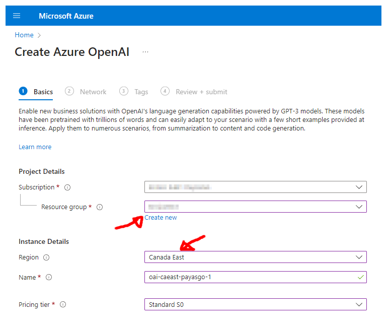
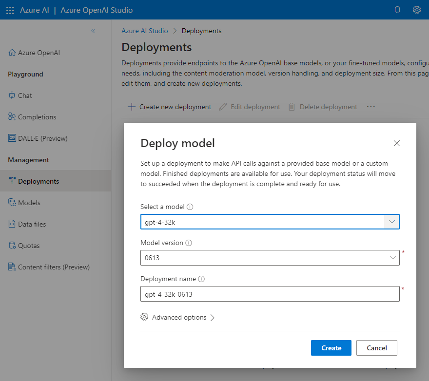

# Configuring Azure OpenAI Service with `big-AGI`

The entire procedure takes about 5 minutes and involves creating an Azure account,
setting up the Azure OpenAI service, deploying models, and configuring `big-AGI`
to access these models.

Please note that Azure operates on a 'pay-as-you-go' pricing model and requires
credit card information tied to a 'subscription' to the Azure service.

## Configuring `big-AGI`

If you have an `API Endpoint` and `API Key`, you can configure big-AGI as follows:

1. Launch the `big-AGI` application
2. Go to the **Models** settings
3. Add a Vendor and select **Azure OpenAI**
    - Enter the Endpoint (e.g., 'https://your-openai-api-1234.openai.azure.com/')
    - Enter the API Key (e.g., 'fd5...........................ba')

The deployed models are now available in the application. If you don't have a configured
Azure OpenAI service instance, continue with the next section.

In addition to using the UI, configuration can also be done using
[environment variables](environment-variables.md).

## Setting Up Azure

### Step 1: Azure Account & Subscription

1. Create an account on [azure.microsoft.com](https://azure.microsoft.com/en-us/)
2. Go to the [Azure Portal](https://portal.azure.com/)
3. Click on **Create a resource** in the top left corner
4. Search for **Subscription** and select **[Create Subscription](https://portal.azure.com/#create/Microsoft.Subscription)**
    - Fill in the required fields and click on **Create**
    - Note down the **Subscription ID** (e.g., `12345678-1234-1234-1234-123456789012`)

### Step 2: Apply for Azure OpenAI Service

We'll now be creating "OpenAI"-specific resources on Azure. This requires to 'apply',
and acceptance should be quick (even as low as minutes).

1. Visit [Azure OpenAI Service](https://aka.ms/azure-openai)
2. Click on **Apply for access**
    - Fill in the required fields (including the subscription ID) and click on **Apply**

Once your application is accepted, you can create OpenAI resources on Azure.

### Step 3: Create Azure OpenAI Resource

For more information, see [Azure: Create and deploy OpenAI](https://learn.microsoft.com/en-us/azure/ai-services/openai/how-to/create-resource?pivots=web-portal)

1. Click on **Create a resource** in the top left corner
2. Search for **OpenAI** and select **[Create OpenAI](https://portal.azure.com/#create/Microsoft.CognitiveServicesOpenAI)**
3. Fill in the necessary fields on the **Create OpenAI** page
   
    - Select the subscription
    - Select a resource group or create a new one
    - Select the region. Note that the region determines the available models.
   > For instance, **Canada East** offers GPT-4-32k models, For the full list, see [GPT-4 models](https://learn.microsoft.com/en-us/azure/ai-services/openai/concepts/models)
    - Name the service (e.g., `your-openai-api-1234`)
    - Select a pricing tier (e.g., `S0` for standard)
    - Select: "All networks, including the internet, can access this resource."
    - Click on **Review + create** and then **Create**

After creating the resource, you can access the API Keys and Endpoints. At any point, you can go to
the OpenAI Service instance page to get this information.

- Click on **Go to resource**
- Click on **Develop**
    - Copy the `Endpoint`, called "Language API", e.g. 'https://your-openai-api-1234.openai.azure.com/'
    - Copy `KEY 1`

### Step 4: Deploy Models

By default, Azure OpenAI resource instances don't have models available. You need to deploy the models you want to use.

1. Click on **Model Deployments > Manage Deployments**
2. Click on **+Create New Deployment**
   
    - Select the model you want to deploy
    - Optionally select a version
    - name the model, e.g., `gpt4-32k-0613`

Repeat as necessary for each model you want to deploy.

## Resources

- [Azure OpenAI Service Documentation](https://learn.microsoft.com/en-us/azure/ai-services/openai/)
- [Guide: Create an Azure OpenAI Resource](https://learn.microsoft.com/en-us/azure/ai-services/openai/how-to/create-resource?pivots=web-portal)
- [Azure OpenAI Models](https://learn.microsoft.com/en-us/azure/ai-services/openai/concepts/models)