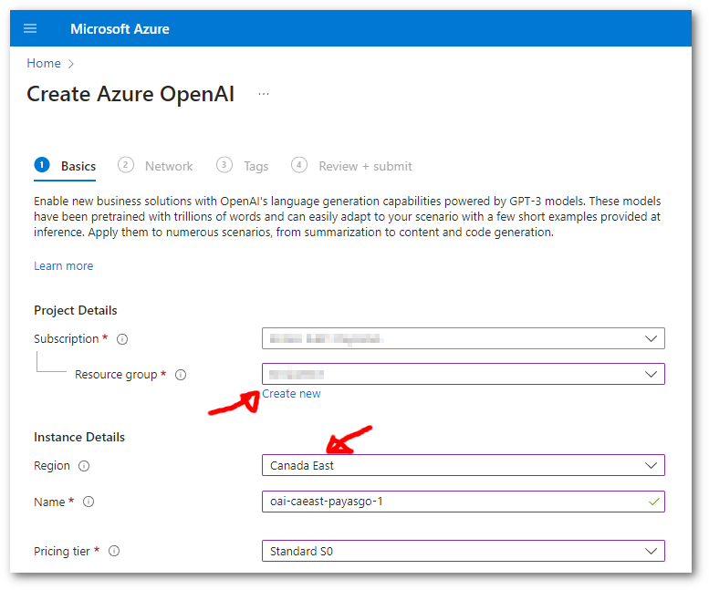

# Configuring Azure OpenAI Service with `big-AGI`

The entire procedure takes about 5 minutes and involves creating an Azure account,
setting up the Azure OpenAI service, deploying models, and configuring `big-AGI`
to access these models.

Please note that Azure operates on a 'pay-as-you-go' pricing model and requires
credit card information tied to a 'subscription' to the Azure service.

## Configuring `big-AGI`

If you have an `API Endpoint` and `API Key`, you can configure big-AGI as follows:

1. Launch the `big-AGI` application
2. Go to the **Models** settings
3. Add a Vendor and select **Azure OpenAI**
    - Enter the Endpoint (e.g., 'https://your-resource-name.openai.azure.com')
    - Enter the API Key (e.g., 'fd5...........................ba')

The deployed models are now available in the application. If you don't have a configured
Azure OpenAI service instance, continue with the next section.

In addition to using the UI, configuration can also be done using
[environment variables](environment-variables.md).

## Server Configuration

For server deployments, set these environment variables:

```bash
AZURE_OPENAI_API_ENDPOINT=https://your-resource-name.openai.azure.com
AZURE_OPENAI_API_KEY=your-api-key
```

This enables Azure OpenAI for all users without requiring individual API keys. For more details, see [environment-variables.md](environment-variables.md).

## Azure OpenAI API Versions

Azure OpenAI supports both traditional deployment-based API and the next-generation v1 API:

### Next-Generation v1 API (Default)
- **Enabled by default** for GPT-5-like models (GPT-5, GPT-6, o3, o4, etc.)
- Uses direct `/openai/v1/responses` endpoint without deployment IDs
- Optimized for advanced reasoning models and new features
- Can be disabled by setting `AZURE_OPENAI_DISABLE_V1=true`

### Traditional Deployment-Based API
- Uses `/openai/deployments/{deployment-name}/...` endpoints
- Required for older models and when v1 API is disabled
- Needs deployment ID for all API calls

### Known Limitations
- **Web Search Tool**: Azure OpenAI does not support the `web_search_preview` tool that's available in OpenAI's API
- Models with web search capabilities will have this feature automatically disabled on Azure

## Setting Up Azure

### Step 1: Azure Account & Subscription

1. Create an account on [azure.microsoft.com](https://azure.microsoft.com/en-us/)
2. Go to the [Azure Portal](https://portal.azure.com/)
3. Click on **Create a resource** in the top left corner
4. Search for **Subscription** and select **[Create Subscription](https://portal.azure.com/#create/Microsoft.Subscription)**
    - Fill in the required fields and click on **Create**
    - Note down the **Subscription ID** (e.g., `12345678-1234-1234-1234-123456789012`)

### Step 2: Create Azure OpenAI Resource

For more information, see [Azure: Create and deploy OpenAI](https://learn.microsoft.com/en-us/azure/ai-services/openai/how-to/create-resource?pivots=web-portal)

1. Click on **Create a resource** in the top left corner
2. Search for **OpenAI** and select **[Create OpenAI](https://portal.azure.com/#create/Microsoft.CognitiveServicesOpenAI)**
3. Fill in the necessary fields on the **Create OpenAI** page
   
    - Select the subscription
    - Select a resource group or create a new one
    - Select the region. **Important**: The region determines which models are available.
   > Popular regions like **East US**, **West Europe**, and **Australia East** typically have the best model availability. For the latest model availability by region, see [Azure OpenAI Model Availability](https://learn.microsoft.com/en-us/azure/ai-services/openai/concepts/models)
    - Name the service (e.g., `your-openai-api-1234`)
    - Select a pricing tier (e.g., `S0` for standard)
    - Select: "All networks, including the internet, can access this resource."
    - Click on **Review + create** and then **Create**

After creating the resource, you can access the API Keys and Endpoints:

1. Click on **Go to resource** (or navigate to your Azure OpenAI resource)
2. In the left sidebar, under **Resource Management**, click on **Keys and Endpoint** 
3. Copy the required information:
   - **Endpoint**: e.g., 'https://your-resource-name.openai.azure.com/'
   - **Key**: Copy either KEY 1 or KEY 2 (both work identically)

### Step 3: Deploy Models

By default, Azure OpenAI resource instances don't have models available. You need to deploy the models you want to use.

1. In your Azure OpenAI resource, click on **Model deployments** in the left sidebar
2. Click on **Create new deployment** 
3. Fill in the deployment details:
   - **Select a model**: Choose from available models
   - **Model version**: Select the latest version or a specific one
   - **Deployment name**: Give it a meaningful name
4. Click **Deploy**

Repeat as necessary for each model you want to deploy.

## Resources

- [Azure OpenAI Service Documentation](https://learn.microsoft.com/en-us/azure/ai-services/openai/)
- [Guide: Create an Azure OpenAI Resource](https://learn.microsoft.com/en-us/azure/ai-services/openai/how-to/create-resource?pivots=web-portal)
- [Azure OpenAI Models](https://learn.microsoft.com/en-us/azure/ai-services/openai/concepts/models)