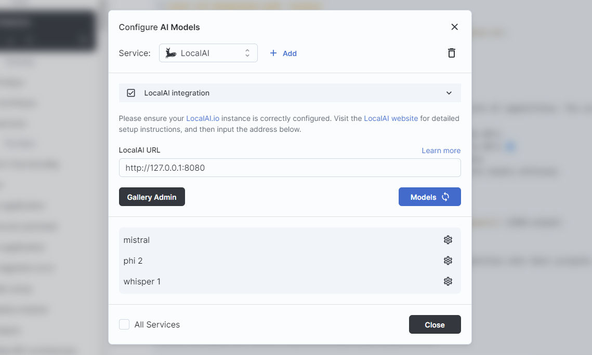
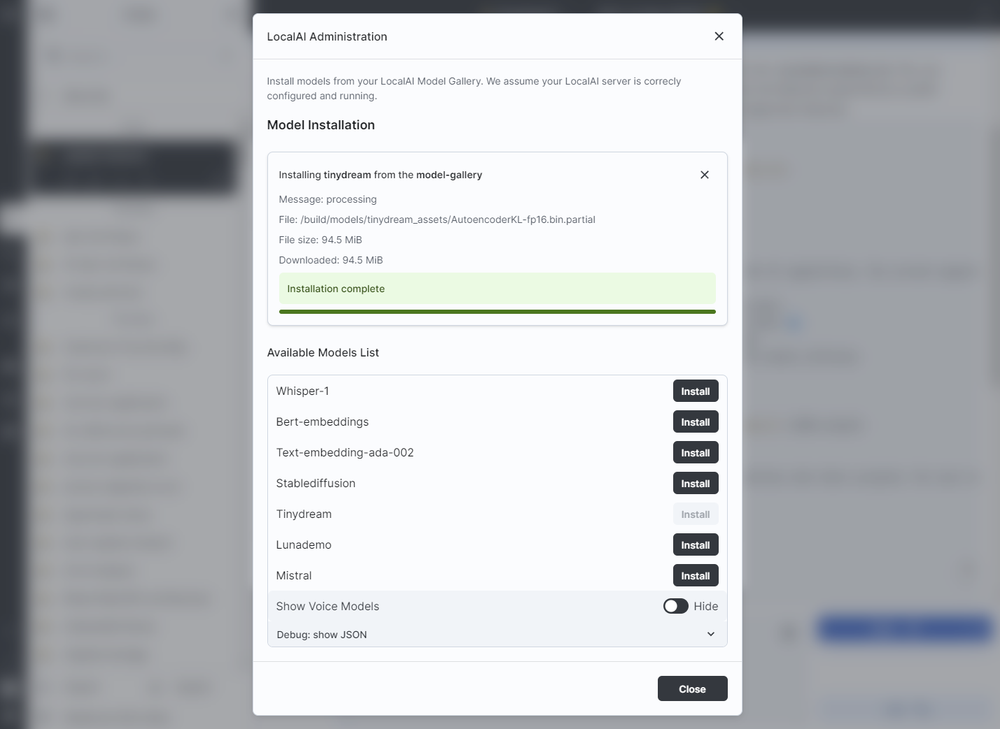

# Run your models with `LocalAI` x `big-AGI`

[LocalAI](https://localai.io) lets you run your AI models locally, or in the cloud. It supports text, image, asr, speech, and more models.

We are deepening the integration between the two products. As of the time of writing, we integrate the following features:

- ✅ [Text generation](https://localai.io/features/text-generation/) with GPTs
- ✅ [Function calling](https://localai.io/features/openai-functions/) by GPTs 🆕
- ✅ [Model Gallery](https://localai.io/models/) to list and install models
- ✖️ [Vision API](https://localai.io/features/gpt-vision/) for image chats
- ✖️ [Image generation](https://localai.io/features/image-generation) with stable diffusion
- ✖️ [Audio to Text](https://localai.io/features/audio-to-text/)
- ✖️ [Text to Audio](https://localai.io/features/text-to-audio/)
- ✖️ [Embeddings generation](https://localai.io/features/embeddings/)
- ✖️ [Constrained grammars](https://localai.io/features/constrained_grammars/) (JSON output)
- ✖️ Voice cloning 🆕

_Last updated Feb 21, 2024_

## Guide

### LocalAI installation and configuration

Follow the guide at: https://localai.io/basics/getting_started/

- verify it works by browsing to [http://localhost:8080/v1/models](http://localhost:8080/v1/models)
  (or the IP:Port of the machine, if running remotely) and seeing listed the model(s) you downloaded
  listed in the JSON response.

### Integration: chat with LocalAI

- Go to Models > Add a model source of type: **LocalAI**
- Enter the default address: `http://localhost:8080`, or the address of your localAI cloud instance
  
  - If running remotely, replace localhost with the IP of the machine. Make sure to use the **IP:Port** format
- Load the models (click on `Models 🔄`)
- Select the model and chat

In addition to using the UI, configuration can also be done using
[environment variables](environment-variables.md).

### Integration: Models Gallery

If the running LocalAI instance is configured with a [Model Gallery](https://localai.io/models/):

- Go to Models > LocalAI
- Click on `Gallery Admin`
- Select the models to install, and view installation progress
  

## Troubleshooting

##### Unknown Context Window Size

At the time of writing, LocalAI does not publish the model `context window size`.
Every model is assumed to be capable of chatting, and with a context window of 4096 tokens.
Please update the [src/modules/llms/transports/server/openai/models.data.ts](../src/modules/llms/server/openai/models.data.ts)
file with the mapping information between LocalAI model IDs and names/descriptions/tokens, etc.

# 🤝 Support

- Hop into the [LocalAI Discord](https://discord.gg/uJAeKSAGDy) for support and questions
- Hop into the [big-AGI Discord](https://discord.gg/MkH4qj2Jp9) for questions
- For big-AGI support, please open an issue in our [big-AGI issue tracker](https://bit.ly/agi-request)
