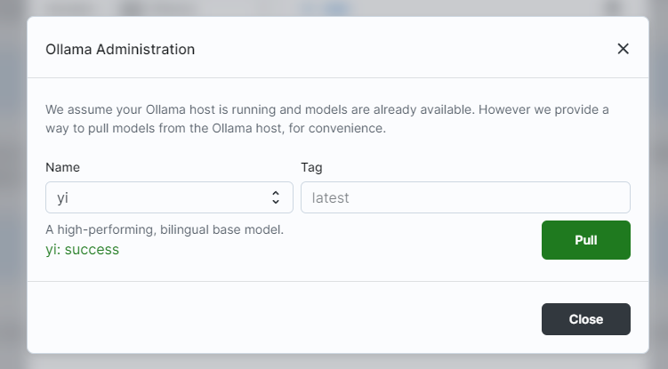

# `Ollama` x `big-AGI` :llama:

This guide helps you connect [Ollama](https://ollama.ai) [models](https://ollama.ai/library) to
[big-AGI](https://big-agi.com) for a professional AI/AGI operation and a good UI/Conversational
experience. The integration brings the popular big-AGI features to Ollama, including: voice chats,
editing tools, models switching, personas, and more.

## Quick Integration Guide

1. **Ensure Ollama API Server is Running**: Before starting, make sure your Ollama API server is up and running.
2. **Add Ollama as a Model Source**: In `big-AGI`, navigate to the **Models** section, select **Add a model source**, and choose **Ollama**.
3. **Enter Ollama Host URL**: Provide the Ollama Host URL where the API server is accessible (e.g., `http://localhost:11434`).
4. **Refresh Model List**: Once connected, refresh the list of available models to include the Ollama models.
5. **Start Using AI Personas**: Select an Ollama model and begin interacting with AI personas tailored to your needs.

### Ollama: installation and Setup

For detailed instructions on setting up the Ollama API server, please refer to the
[Ollama download page](https://ollama.ai/download) and [instructions for linux](https://github.com/jmorganca/ollama/blob/main/docs/linux.md).

### Visual Guide

* After adding the `Ollama` model vendor, entering the IP address of an Ollama server, and refreshing models:
  
* The `Ollama` admin panel, with the `Pull` button highlighted, after pulling the "Yi" model:
  

### Advanced Configuration

For users who wish to delve deeper into advanced settings, `big-AGI` offers additional configuration options, such
as the model temperature, maximum tokens, etc.

### Community and Support

Join our community to share your experiences, get help, and discuss best practices:

---

`big-AGI` is committed to providing a powerful, intuitive, and privacy-respecting AI experience.
We are excited for you to explore the possibilities with Ollama models. Happy creating!