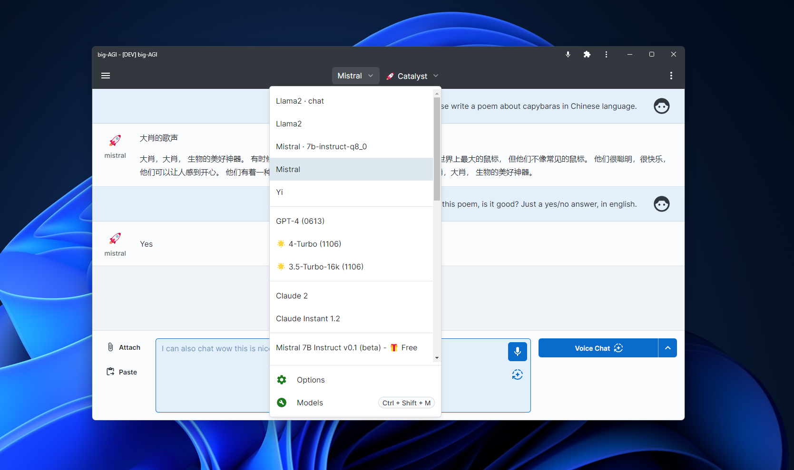

# `Ollama` x `big-AGI` :llama:

This guide helps you connect [Ollama](https://ollama.ai) [models](https://ollama.ai/library) to
[big-AGI](https://big-agi.com) for a professional AI/AGI operation and a good UI/Conversational
experience. The integration brings the popular big-AGI features to Ollama, including: voice chats,
editing tools, models switching, personas, and more.

_Last updated Dec 16, 2023_



## Quick Integration Guide

1. **Ensure Ollama API Server is Running**: Follow the official instructions to get Ollama up and running on your machine
   - For detailed instructions on setting up the Ollama API server, please refer to the
   [Ollama download page](https://ollama.ai/download) and [instructions for linux](https://github.com/jmorganca/ollama/blob/main/docs/linux.md).
2. **Add Ollama as a Model Source**: In `big-AGI`, navigate to the **Models** section, select **Add a model source**, and choose **Ollama**
3. **Enter Ollama Host URL**: Provide the Ollama Host URL where the API server is accessible (e.g., `http://localhost:11434`)
4. **Refresh Model List**: Once connected, refresh the list of available models to include the Ollama models
   > Optional: use the Ollama Admin interface to see which models are available and 'Pull' them in your local machine. Note
   that this operation will likely timeout due to Edge Functions timeout on the big-AGI server while pulling, and
   you'll have to press the 'Pull' button again, until a green message appears.
5. **Chat with Ollama models**: select an Ollama model and begin chatting with AI personas

In addition to using the UI, configuration can also be done using
[environment variables](environment-variables.md).

**Visual Configuration Guide**:

* After adding the `Ollama` model vendor, entering the IP address of an Ollama server, and refreshing models:<br/>
  

* The `Ollama` admin panel, with the `Pull` button highlighted, after pulling the "Yi" model:<br/>
  

* You can now switch model/persona dynamically and text/voice chat with the models:<br/>
  

<br/>

### ⚠️ Network Troubleshooting

If you get errors about the server having trouble connecting with Ollama, please see
[this message](https://github.com/enricoros/big-AGI/issues/276#issuecomment-1858591483) on Issue #276.

And in brief, make sure the Ollama endpoint is accessible from the servers where you run big-AGI (which could
be localhost or cloud servers).


<br/>

### Advanced: Model parameters

For users who wish to delve deeper into advanced settings, `big-AGI` offers additional configuration options, such
as the model temperature, maximum tokens, etc.

### Advanced: Ollama under a reverse proxy

You can elegantly expose your Ollama server to the internet (and thus make it easier to use from your server-side
big-AGI deployments) by exposing it on an http/https URL, such as: `https://yourdomain.com/ollama`

On Ubuntu Servers, you will need to install `nginx` and configure it to proxy requests to Ollama.

```bash
sudo apt update
sudo apt install nginx
sudo apt install certbot python3-certbot-nginx
sudo certbot --nginx -d yourdomain.com
```

Then, edit the nginx configuration file `/etc/nginx/sites-enabled/default` and add the following block:

```nginx
    location /ollama/ {
        proxy_pass http://127.0.0.1:11434/;

        # Disable buffering for the streaming responses (SSE)
        proxy_set_header Connection '';
        proxy_http_version 1.1;
        chunked_transfer_encoding off;
        proxy_buffering off;
        proxy_cache off;
        
        # Longer timeouts (1hr)
        keepalive_timeout 3600;
        proxy_read_timeout 3600;
        proxy_connect_timeout 3600;
        proxy_send_timeout 3600;
    }
```

Reach out to our community if you need help with this.

<br/>

### Community and Support

Join our community to share your experiences, get help, and discuss best practices:

[](https://discord.gg/MkH4qj2Jp9)


---

`big-AGI` is committed to providing a powerful, intuitive, and privacy-respecting AI experience.
We are excited for you to explore the possibilities with Ollama models. Happy creating!
