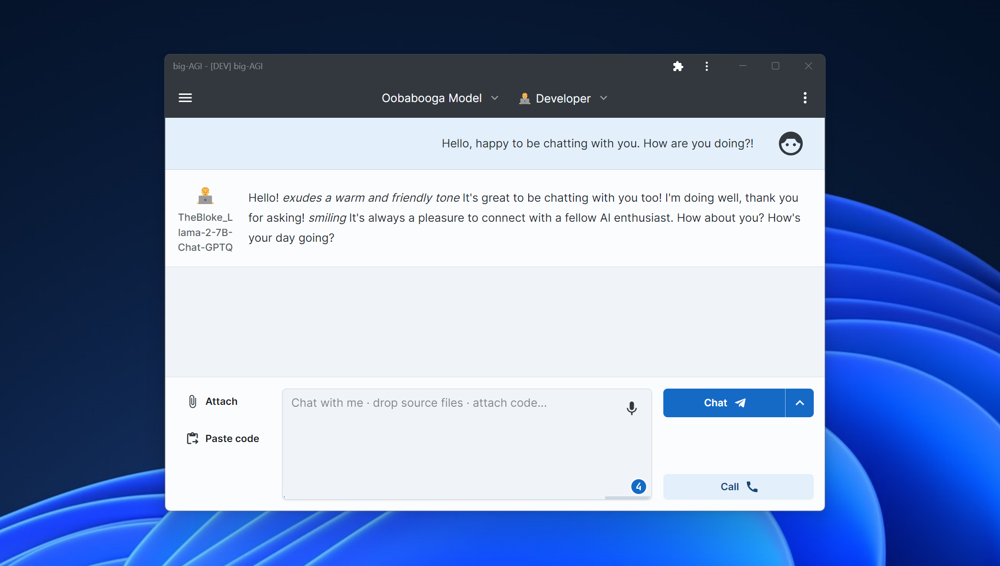

# Local LLM Integration with `text-web-ui` :llama:

Integrate local Large Language Models (LLMs) with
[oobabooga/text-generation-webui](https://github.com/oobabooga/text-generation-webui),
a specialized interface that includes a custom variant of the OpenAI API for a smooth integration process.

_Last updated on Dec 7, 2023_

### Components

The implementation of local LLMs involves the following components:

* **text-generation-webui**: A Python application with a Gradio web UI for operating Large Language Models.
    * **Local Large Language Models "LLMs"**: Use large language models on your personal computer with consumer-grade GPUs or CPUs.
* **big-AGI**: An LLM UI that offers features such as Personas, OCR, Voice Support, Code Execution, AGI functions, and more.

## Instructions

This guide assumes that **big-AGI** is already installed on your system. Note that the text-generation-webui IP address must be accessible from the server running **big-AGI**.

### Text-web-ui Installation & Configuration:

1. Install [text-generation-webui](https://github.com/oobabooga/text-generation-webui#Installation):
    - Follow the instructions in the official page (basicall clone the repo and run a script) [~10 minutes]
    - Stop the Web UI as we need to modify the startup flags to enable the OpenAI API
2. Enable the **openai extension**
    - Edit `CMD_FLAGS.txt`
    - Make sure that `--listen --api` is present and uncommented
3. Restart text-generation-webui
    - Double-click on "start"
    - You should see something like:
      ```
      2023-12-07 21:51:21 INFO:Loading the extension "openai"...
      2023-12-07 21:51:21 INFO:OpenAI-compatible API URL:

      http://0.0.0.0:5000
      ...
      INFO:     Uvicorn running on http://0.0.0.0:5000 (Press CTRL+C to quit)
      Running on local URL:  http://0.0.0.0:7860
      ```
    - This shows that:
      - The Web UI is running on port 7860: http://127.0.0.1:7860
      - **The OpenAI API is running on port 5000: http://127.0.0.1:5000**
4. Load your first model
    - Open the text-generation-webui at [127.0.0.1:7860](http://127.0.0.1:7860/)
    - Switch to the **Model** tab
    - Download, for instance, `TheBloke/Llama-2-7B-Chat-GPTQ`
    - Select the model once it's loaded

### Integrating text-web-ui with big-AGI:
1. Integrating Text-Generation-WebUI with big-AGI:
    - Go to Models > Add a model source of type: **Oobabooga**
    - Enter the address: `http://127.0.0.1:5000`
        - If running remotely, replace 127.0.0.1 with the IP of the machine. Make sure to use the **IP:Port** format
    - Load the models
        - The active model must be selected and LOADED on the text-generation-webui as it doesn't support model switching or parallel requests.
    - Select model & Chat



Enjoy the privacy and flexibility of local LLMs with `big-AGI` and `text-generation-webui`!