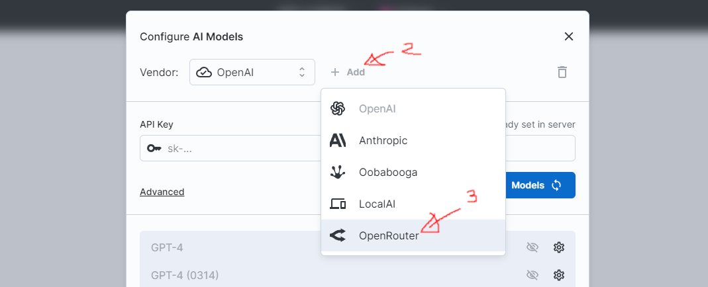
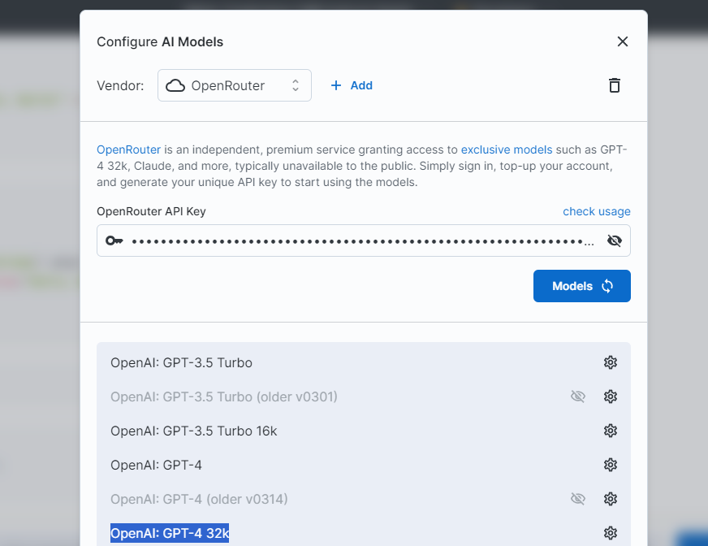

# OpenRouter Configuration

[OpenRouter](https://openrouter.ai) is a standalone, premium service
that provides access to <Link href='https://openrouter.ai/docs#models' target='_blank'>exclusive AI models</Link>
such as GPT-4 32k, Claude, and more. These models are typically not available to the public.
This document details the process of integrating OpenRouter with big-AGI.

### 1. OpenRouter Account Setup and API Key Generation

1. Register for an OpenRouter account at [openrouter.ai](https://openrouter.ai) by clicking on Sign In > Continue with Google.
2. Top up your account (minimum $5) by navigating to [openrouter.ai/account](https://openrouter.ai/account) > Add Credits > Pay with Stripe.
3. Generate an API key at [openrouter.ai/keys](https://openrouter.ai/keys) > API Key > Generate API Key.
   - **Remember to copy and securely store your API key** - the key will not be displayed again and will be in the format `sk-or-v1-...`.
   - Keep the key confidential as it can be used to expend your credits.

### 2. Integrating OpenRouter with big-AGI

1. Launch big-AGI, and navigate to the AI **Models** settings.
2. Add a Vendor, and select **OpenRouter**.
   
3. Input the API key into the **OpenRouter API Key** field, and load the Models.
   
4. OpenAI GPT4-32k and other models will now be accessible and selectable in the application.

In addition to using the UI, configuration can also be done using
[environment variables](environment-variables.md).

### Pricing

OpenRouter independently manages its service and pricing and is not affiliated with big-AGI.
For more detailed information, please visit [this page](https://openrouter.ai/docs#models).

Please note that running large models such as GPT-4 32k can be costly and may rapidly consume
credits - a single prompt may cost $1 or more, at the time of writing.