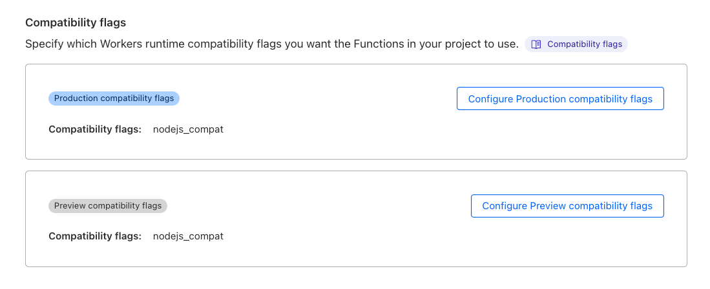

# Deploying a Next.js App on Cloudflare Pages

> WARNING: Cloudflare Pages does not support traditional NodeJS runtimes, but only Edge Runtime functions.
>
> In this project we use Prisma connected to serverless Postgres, which at the moment cannot run on
> edge functions, so we cannot deploy this project on Cloudflare Pages.
>
> Workaround: Step 3.4. has been added below, to DELETE the NodeJS traditional runtime - which means that some
> parts of this application will not work.
>  - [Side effects](https://github.com/enricoros/big-agi/blob/main/src/apps/chat/trade/server/trade.router.ts#L19):
     > Sharing functionality to DB, and import from ChatGPT share, and post to Paste.GG will not work
>  - See [Issue 174](https://github.com/enricoros/big-agi/issues/174).
>
> Longer term: follow [prisma/prisma: Support Edge Function deployments](https://github.com/prisma/prisma/issues/21394)
> and convert the Node runtime to Edge runtime once Prisma supports it.

This guide provides steps to deploy your Next.js app on Cloudflare Pages.
It is based on the [official Cloudflare developer documentation](https://developers.cloudflare.com/pages/framework-guides/deploy-a-nextjs-site/),
with some additional steps.

## Step 1: Repository Forking

Fork the repository to your personal GitHub account.

## Step 2: Linking Cloudflare Pages to Your GitHub Account

1. Navigate to the Cloudflare Pages section and click on the `Create a project` button.
2. Click `Connect To Git` and grant Cloudflare Pages access to either all GitHub account repositories or selected repositories.
   We recommend using selected Repo access and selecting the forked repository from step 1.

## Step 3: Configuring Build and Deployments

1. After selecting the forked GitHub repository, click the **Begin Setup** button
2. On this page, set your **Project name**, **Production branch** (e.g., main), and your Build settings
3. Choose `Next.js` from the **Framework preset** dropdown menu
4. Set a custom **Build Command**:
    - `rm app/api/cloud/[trpc]/route.ts && npx @cloudflare/next-on-pages@1`
    - see the tradeoffs for this deletion on the notice at the top
5. Keep the **Build output directory** as default
6. Click the **Save and Deploy** button

## Step 4: Monitoring the Deployment Process

Observe the process as it initializes your build environment, clones the GitHub repository, builds the application, and deploys it
to the Cloudflare Network. Once complete, proceed to the project you created.

## Step 5: Required: Set the `nodejs_compat` compatibility flag

1. Navigate to the [Settings > Functions](https://dash.cloudflare.com/?to=/:account/pages/view/:pages-project/settings/functions) page of your newly created project
2. Scroll to `Compatibility flags` and enter "`nodejs_compat`" for both **Production** and **Preview** environments.
   It should look like this: 
3. Re-deploy your project for the new flags to take effect

## Step 6: (Optional) Custom Domain Configuration

Use the `Custom domains` tab to set up your domain via CNAME.

## Step 7: (Optional) Access Policy and Web Analytics Configuration

Navigate to the `Settings` page and enable the following settings:

1. Access Policy: Restrict [preview deployments](https://developers.cloudflare.com/pages/platform/preview-deployments/)
   to members of your Cloudflare account via one-time pin and restrict primary `*.YOURPROJECT.pages.dev` domain.
   Refer to [Cloudflare Pages known issues](https://developers.cloudflare.com/pages/platform/known-issues/#enabling-access-on-your-pagesdev-domain)
   for more details.
2. Enable Web Analytics.

Congratulations! You have successfully deployed your Next.js app on Cloudflare Pages.