# AIX

AIX is a client/server library for integrating advanced AI capabilities into web applications.

## Overview

AIX provides real-time, type-safe communication between a Typescript application and AI providers.

Built with tRPC, it manages the lifecycle of AI-generated content from request to rendering, supporting both streaming and non-streaming AI providers.

## Features

- Content Generation
  - Multi-Modal streaming/non-streaming
  - Throttled batching and error handling
  - Server-side timeout/retry
- Function Calling and Code Execution
- Complex AI Workflows (future)
- Embeddings / Information Retrieval / Image Manipulation (future)

## AIX Providers support

| Service    | Chat       | Function Calling | Multi-Modal Input | Cont. (1) | Streaming | Idiosyncratic | 
|------------|------------|------------------|-------------------|-----------|-----------|---------------|
| Alibaba    | ✅          | ✅                |                   | ✅         | Yes + 📦  |               |
| Anthropic  | ✅          | ✅ + Parallel     | Img: ✅            | ✅         | Yes + 📦  |               |
| Azure      | ✅          | ✅                |                   | ✅         | Yes + 📦  |               |
| Deepseek   | ✅          | ❌ (rejected)     |                   | ✅         | Yes + 📦  |               |
| Gemini     | ✅          | ✅ + Parallel     | Img: ✅            | ✅         | Yes + 📦  | Code ex.: ✅   |
| Groq       | ✅          | ✅ + Parallel     |                   | ✅         | Yes + 📦  |               |
| LM Studio  | ✅          | ❌ (not working)  |                   | ❌         | Yes  + 📦 |               |
| Local AI   | ✅          | ✅                |                   | ❌         | Yes  + 📦 |               |
| Mistral    | ✅          | ✅                |                   | ✅         | Yes  + 📦 |               |
| OpenAI     | ✅          | ✅ + Parallel     | Img: ✅            | ✅         | Yes + 📦  |               |
| OpenPipe   | ✅          | ✅                | Img: ✅            | ✅         | Yes + 📦  |               |
| OpenRouter | ✅          | ❌ (inconsistent) |                   | ✅         | Yes + 📦  |               |
| Perplexity | ✅          | ❌ (rejected)     |                   | ✅         | Yes + 📦  |               |
| TogetherAI | ✅          | ✅                |                   | ✅         | Yes + 📦  |               |
| xAI        |            |                  |                   |           |           |               |
| Ollama (2) | ❌ (broken) | ?                |                   |           |           |               |

Notes:

- 1: Continuation marks: a. sends reason=max-tokens (streaming/non-streaming), b. TBA
- 2: Ollama has not been ported to AIX yet due to the custom APIs.

## 1. System Architecture

The subsystem comprises three main components:

1. **Client (e.g. Next.js Frontend)**

- Initiates requests
- Renders AI-generated content in real-time
- Reconstructs streamed data

2. **Server (e.g. Next.js Backend)**

- Acts as an intermediary between client and AI providers
- Handles request preparation, dispatching, and response processing
- Streams responses back to the client

3. **Upstream AI Providers**

- Generate AI content based on requests

### ChatGenerate workflow:

1. Request Initialization: AIX Client prepares and sends request (systemInstruction, messages=AixWire_Parts[], etc.) to AIX Server
2. Dispatch Preparation: AIX Server prepares for upstream communication
3. AI Provider Interaction: AIX Server communicates with AI Provider (streaming or non-streaming)
4. Data Decoding, Transformation and Transmission: AIX Server sends AixWire_Particles to AIX Client
5. Client-side Processing: Client's ContentReassembler processes AixWire_Particles into a list (likely a single) of multi-fragment (DMessageContentFragment[]) messages
6. Completion: AIX Server sends 'done' control message, AIX Client finalizes data update
7. Error Handling: AIX Server sends specific error messages when necessary

## 2. Files and Folders

AIX is organized into the following files and folders:

1. Client-Side (`/client/`):

- `aix.client.ts`: Main client-side entry point for AIX operations.
- `aix.client.chatGenerateRequest.ts`: Handles conversion of chat messages to AIX-compatible format (AixWire_Content, AixWire_Parts, etc.).

2. Server-Side (`/server/`):

- API (`/server/api/`) - Client to Server communication:
  - `aix.router.ts`: Defines the tRPC router for AIX operations.
  - `aix.wiretypes.ts`: Contains Zod schemas for types and calls incoming from the client (AixWire_Parts, AixWire_Content, AixWire_Tooling, AixWire_API, ...), and outgoing (AixWire_Particles)

- Dispatch (`/server/dispatch/`) - Server to AI Provider communication:
  - `/server/dispatch/chatGenerate/`: Content Generation with chat-style inputs:
    - `./adapters/`: Adapters for creating API requests for different AI protocols (Anthropic, Gemini, OpenAI).
    - `./parsers/`: Parsers for parsing streaming/non-streamin responses from different AI protocols (same 3).
    - `chatGenerate.dispatch.ts`: Creates a pipeline to execute Chat Generation to a specific provider.
    - `ChatGenerateTransmitter.ts`: Used to serialize and transmit AixWire_Particles to the client.
  - `/server/dispatch/wiretypes/`: AI provider Wire Types:
    - Type definitions for different AI providers/protocols (Anthropic, Gemini, OpenAI).
  - `stream.demuxers.ts`: Handles demuxing of different stream formats.

## 3. Architecture Diagram

```mermaid
sequenceDiagram
    participant AIX Client
    participant AIX Server
    participant PartTransmitter
    participant AI Provider
    AIX Client ->> AIX Client: Initialize ContentReassembler
    AIX Client ->> AIX Client: Convert DMessage*Part to AixWire_Parts
    AIX Client ->> AIX Server: Send messages (arrays of AixWire_Parts)
    AIX Server ->> AIX Server: Prepare Dispatch (Upstream request, demux, parsing)

    alt Dispatch Preparation Error
        AIX Server ->> AIX Client: Send `dispatch-prepare` error message
    else Dispatch Fetch
        AIX Server ->> AI Provider: Send AI-provider specific stream/non-stream request
        AIX Server ->> AIX Client: Send 'start' control message
        AIX Server ->> PartTransmitter: Initialize part particle serialization

        alt Streaming AI Provider
            loop Until stream end or error
                AI Provider ->> AIX Server: Stream response chunk
                AIX Server ->> AIX Server: Demux chunk into DispatchEvents
                loop For each AI-provider specific DispatchEvent
                    AIX Server ->> AIX Server: Parse DispatchEvent
                    AIX Server ->> PartTransmitter: (Parser) Calls serialization functions
                    PartTransmitter ->> PartTransmitter: Generate and throttle AixWire_PartParticles
                    PartTransmitter -->> AIX Server: Yield AixWire_PartParticle
                end
                AIX Server ->> AIX Client: Send accumulated AixWire_PartParticles
            end
            AIX Server ->> PartTransmitter: Request any remaining particles
            PartTransmitter -->> AIX Server: Yield any final AixWire_PartParticles
            AIX Server ->> AIX Client: Send final AixWire_PartParticles (if any)
        else Non-Streaming AI Provider
            AI Provider ->> AIX Server: Send AI-provider specific complete response
            alt AI-provider specific full-response parser
                AIX Server ->> AIX Server: Parse full response
                AIX Server ->> PartTransmitter: Call particle serialization functions
                PartTransmitter ->> PartTransmitter: Generate AixWire_PartParticle
                PartTransmitter -->> AIX Server: Yield ALL AixWire_PartParticle
            end
            AIX Server ->> AIX Client: Send all AixWire_PartParticles
        end
        AIX Server ->> AIX Client: Send 'done' control message
        loop For each received batch of particles
            AIX Client ->> AIX Client: ContentReassembler processes particles into DMessage*Part
            alt DMessageTextPart
                AIX Client ->> AIX Client: Update UI with text content
            else DMessageImageRefPart
                AIX Client ->> AIX Client: Load and display image
            else DMessageToolInvocationPart
                AIX Client ->> AIX Client: Process tool invocation (dev only)
            else DMessageToolResponsePart
                AIX Client ->> AIX Client: Process tool response (dev only)
            else DMessageErrorPart
                AIX Client ->> AIX Client: Display error message
            else DMessageDocPart
                AIX Client ->> AIX Client: Process and display document
            else DMetaPlaceholderPart
                AIX Client ->> AIX Client: Handle placeholder (non-submitted)
            end
        end
        AIX Client ->> AIX Client: Finalize data update
    end

    alt Error Handling
        AIX Server ->> AIX Client: Send 'error' specific control messages
    end

    note over AIX Server, AI Provider: Server-side Timeout/Retry mechanism
    loop Retry on timeout (server-side)
        AIX Server ->> AI Provider: Retry request
    end

    note over AIX Client: Client-side Timeout mechanism
    AIX Client ->> AIX Client: Timeout if no response received within set time
```

---

### 2025-03-14 Update
AIX is used in production in Big-AGI and is stable and performant.
The code is tightly coupled with the tRPC framework and the rest of our codebase,
so it is not recommended to use it outside of our ecosystem.

For a great Typescript alternative we recommend the Vercel AI SDK.
