# Big-AGI Routing & Display States

This document describes the routing architecture and display state hierarchy in Big-AGI, from top-level providers down to component-level states.

## Overview

Big-AGI uses Next.js Pages Router with a provider stack that determines what users see based on application state and configuration.

## Quick Reference: Route Configurations

| Route | Purpose | Key Features |
|-------|---------|--------------|
| `/` | Main chat app | Default application |
| `/call` | Voice interface | Voice-to-voice AI conversations |
| `/personas` | Persona management | Create and manage AI personas |
| ... |  |  |

## Decision Flow Diagram

The routing decisions follow a hierarchy from system-level provider configuration down to component-level states.

```mermaid
flowchart TD
    Start([Navigate to Route]) --> Root[_app.tsx]

    Root --> Theme[ProviderTheming]
    Theme --> Error[ErrorBoundary]
    Error --> Bootstrap[ProviderBootstrapLogic]

    Bootstrap --> BootCheck{Bootstrap Checks}
    BootCheck -->|News| News[↗️ /news]
    BootCheck -->|Continue| Router{Router}

    Router -->|/| Chat[Chat App]
    Router -->|/personas,/call,/beam...| OtherApps[Other Apps]
    Router -->|/news| NewsApp[News App]

    Chat --> ChatStates{Chat States}

    ChatStates -->|No Models| ZeroModels[🟡 Setup Models]
    ChatStates -->|No Conv| ZeroConv[🟡 Select Chat]
    ChatStates -->|No Msgs| PersonaGrid[Choose Persona]
    ChatStates -->|Ready| Active[🟢 Active Chat]

    Active --> Features[Features:<br/>• Chat Bar<br/>• Beam Mode<br/>• Attachments]

    style ZeroModels fill:#fff4cc
    style ZeroConv fill:#fff4cc
    style Active fill:#ccffcc
    style Chat fill:#f0f8ff
    style OtherApps fill:#f0f8ff
    style NewsApp fill:#f0f8ff
```



## Display State Hierarchy

```
_app.tsx (Root)
├── ProviderTheming ← Always Applied
├── ErrorBoundary ← Always Applied
├── ProviderBootstrapLogic ← Always Applied
│   ├── Tiktoken preload & Model auto-config
│   ├── Storage maintenance & cleanup
│   └── News Redirect (if conditions met)
│
└── Page Component
    ├── AppChat (/) → Default app
    │   ├── CMLZeroModels → If no models configured
    │   ├── CMLZeroConversation → If no conversation selected
    │   └── PersonaGrid → If conversation empty
    │
    └── Other Apps → Personas, Call, Draw, News, Beam
```

## Provider Stack

| Provider | Purpose | Key Functions |
|----------|---------|---------------|
| **ProviderTheming** | UI theme management | Theme switching, CSS variables |
| **ErrorBoundary** | Error handling | Catches and displays errors gracefully |
| **ProviderBootstrapLogic** | App initialization | • Tiktoken preload<br>• Model auto-config<br>• Storage cleanup<br>• News redirect logic |

For detailed initialization sequence and provider functions, see [app-startup-sequence.md](app-startup-sequence.md), if present.

## Application Routes

### Primary Apps
- `/` → AppChat (default)
- `/call` → Voice call interface
- `/beam` → Multi-model reasoning
- `/draw` → Image generation
- `/personas` → Personas app
- `/news` → News/updates

### Zero States

#### Chat App Zero States

**CMLZeroModels**
- **Location**: `/src/apps/chat/components/messages-list/CMLZeroModels.tsx`
- **Triggered**: No LLM sources configured
- **Shows**: Welcome screen with "Setup Models" button

**CMLZeroConversation**
- **Location**: `/src/apps/chat/components/messages-list/CMLZeroConversation.tsx`
- **Triggered**: No conversation selected
- **Shows**: "Select/create conversation" prompt

**PersonaGrid**
- **App**: Chat (when conversation is empty)
- **Triggered**: Conversation exists but has no messages
- **Shows**: Persona selector interface

#### Feature-Specific Zero States

**Beam Tutorial**
- **Feature**: Beam (multi-model reasoning)
- **Component**: `ExplainerCarousel`
- **Triggered**: First-time Beam usage
- **Shows**: Interactive feature walkthrough

## Common Scenarios

### New User First Visit
1. Navigates to `/` → Provider stack loads
2. Bootstrap runs → No news redirect (first visit)
3. Chat loads → **CMLZeroModels** (no models configured)
4. User clicks "Setup Models" → Configuration flow

### Returning User with Saved State
1. Navigates to `/` → Provider stack loads
2. IndexedDB restores state → Previous conversation loaded
3. Chat loads → **Active chat interface** (bypasses all zero states)
4. All messages and context preserved from last session

### Shared Chat Viewer
1. Navigates to `/link/chat/[id]` → Full provider stack
2. Views read-only chat → May see "Import" option
3. If importing → Checks for duplicates, creates new local conversation

## Storage System

Big-AGI uses a local-first architecture:
- **Zustand** for reactive state management
- **IndexedDB** for persistent storage via Zustand persist middleware
- **Version-based migrations** for data structure upgrades

Key stores:
- `app-chats`: Conversations and messages (IndexedDB)
- `app-llms`: Model configurations (IndexedDB)
- `app-ui`: UI preferences (localStorage)
