# AIX

AIX is a client/server library for integrating advanced AI capabilities into web applications.

## Overview

AIX provides real-time, type-safe communication between a Typescript application and AI providers.

Built in tRPC, it manages the lifecycle of AI-generated content from request to rendering, supporting both streaming and non-streaming AI providers.

## Features

- Content Generation
  - Multi-Modal streaming/non-streaming
  - Throttled batching and error handling
  - Server-side timeout/retry
- (future) Information Extraction, Image Manipulation
- (future) Complex AI Workflows

## AIX Providers support

| Service    | Chat       | Function Calling | Multi-Modal Input | Streaming | Idiosyncratic | 
|------------|------------|------------------|-------------------|-----------|---------------|
| Anthropic  | ✅          | ✅ + Parallel     | Img: ✅            | Yes + 📦  |               |
| Azure      | ✅          | ✅                |                   | Yes + 📦  |               |
| Deepseek   | ✅          | ❌ (rejected)     |                   | Yes + 📦  |               |
| Gemini     | ✅          | ✅ + Parallel     | Img: ✅            | Yes + 📦  | Code ex.: ✅   |
| Groq       | ✅          | ✅ + Parallel     |                   | Yes + 📦  |               |
| LM Studio  | ✅          | ❌ (not working)  |                   | Yes  + 📦 |               |
| Local AI   | ✅          | ✅                |                   | Yes  + 📦 |               |
| Mistral    | ✅          | ✅                |                   | Yes  + 📦 |               |
| OpenAI     | ✅          | ✅ + Parallel     | Img: ✅            | Yes + 📦  |               |
| OpenRouter | ✅          | ❌ (inconsistent) |                   | Yes + 📦  |               |
| Perplexity | ✅          | ❌ (rejected)     |                   | Yes + 📦  |               |
| TogetherAI | ✅          | ✅                |                   | Yes + 📦  |               |
| Ollama     | ❌ (broken) | ?                |                   |           |               |
| Oobabooga  | ?          | ?                |                   |           |               |  

Notes:

- Ollama has not been ported to AIX yet due to the custom APIs.
- Oobabooga is deprecated and will be removed.

## 2. System Architecture

The subsystem comprises three main components, each playing a crucial role in the data flow:

1. **Client (e.g. Next.js Frontend)**

- Initiates requests
- Renders AI-generated content in real-time
- Reconstructs streamed data

2. **Server (e.g. Next.js Backend)**

- Acts as an intermediary between client and AI providers
- Handles request preparation, dispatching, and response processing
- Streams responses back to the client

3. **Upstream AI Providers**

- Generate AI content based on requests

### ChatGenerate workflow:

1. Request Initialization: AIX Client prepares and sends AixWire_Parts to AIX Server
2. Dispatch Preparation: AIX Server prepares for upstream communication
3. AI Provider Interaction: AIX Server communicates with AI Provider (streaming or non-streaming)
4. Data Decoding, Transformation and Transmission: AIX Server sends AixWire_PartParticles to AIX Client in batches
5. Client-side Processing: PartReassembler processes particles into AixWire_Parts
6. Completion: AIX Server sends 'done' control message, AIX Client finalizes data update
7. Error Handling: AIX Server sends specific error messages when necessary

```mermaid
sequenceDiagram
    participant AIX Client
    participant AIX Server
    participant ParticleEmitter
    participant AI Provider
    AIX Client ->> AIX Client: Initialize PartReassembler
    AIX Client ->> AIX Client: Convert DMessage*Part to AixWire_Parts
    AIX Client ->> AIX Server: Send messages (arrays of AixWire_Parts)
    AIX Server ->> AIX Server: Prepare Dispatch (Upstream request, demux, parsing)

    alt Dispatch Preparation Error
        AIX Server ->> AIX Client: Send `dispatch-prepare` error message
    else Dispatch Fetch
        AIX Server ->> AI Provider: Send AI-provider specific stream/non-stream request
        AIX Server ->> AIX Client: Send 'start' control message
        AIX Server ->> ParticleEmitter: Initialize particle emission

        alt Streaming AI Provider
            loop Until stream end or error
                AI Provider ->> AIX Server: Stream response chunk
                AIX Server ->> AIX Server: Demux chunk into DispatchEvents
                loop For each AI-provider specific DispatchEvent
                    AIX Server ->> AIX Server: Parse DispatchEvent
                    AIX Server ->> ParticleEmitter: Call particle emission function
                    ParticleEmitter ->> ParticleEmitter: Generate and potentially throttle AixWire_PartParticles
                    ParticleEmitter -->> AIX Server: Yield AixWire_PartParticle
                end
                AIX Server ->> AIX Client: Send accumulated AixWire_PartParticles
            end
            AIX Server ->> ParticleEmitter: Request any remaining particles
            ParticleEmitter -->> AIX Server: Yield any final AixWire_PartParticles
            AIX Server ->> AIX Client: Send final AixWire_PartParticles (if any)
        else Non-Streaming AI Provider
            AI Provider ->> AIX Server: Send AI-provider specific complete response
            alt AI-provider specific full-response parser
                AIX Server ->> AIX Server: Parse full response
                AIX Server ->> ParticleEmitter: Call particle emission function
                ParticleEmitter ->> ParticleEmitter: Generate AixWire_PartParticle
                ParticleEmitter -->> AIX Server: Yield ALL AixWire_PartParticle
            end
            AIX Server ->> AIX Client: Send all AixWire_PartParticles
        end
        AIX Server ->> AIX Client: Send 'done' control message
        loop For each received batch of particles
            AIX Client ->> AIX Client: PartReassembler processes particles into DMessage*Part
            alt DMessageTextPart
                AIX Client ->> AIX Client: Update UI with text content
            else DMessageImageRefPart
                AIX Client ->> AIX Client: Load and display image
            else DMessageToolInvocationPart
                AIX Client ->> AIX Client: Process tool invocation (dev only)
            else DMessageToolResponsePart
                AIX Client ->> AIX Client: Process tool response (dev only)
            else DMessageErrorPart
                AIX Client ->> AIX Client: Display error message
            else DMessageDocPart
                AIX Client ->> AIX Client: Process and display document
            else DMetaPlaceholderPart
                AIX Client ->> AIX Client: Handle placeholder (non-submitted)
            end
        end
        AIX Client ->> AIX Client: Finalize data update
    end

    alt Error Handling
        AIX Server ->> AIX Client: Send 'error' specific control messages
    end

    note over AIX Server, AI Provider: Server-side Timeout/Retry mechanism
    loop Retry on timeout (server-side)
        AIX Server ->> AI Provider: Retry request
    end

    note over AIX Client: Client-side Timeout mechanism
    AIX Client ->> AIX Client: Timeout if no response received within set time
```



## 3. Files and Folders

AIX is organized into the following files and folders:

1. Client-Side (`/client/`):

- `aix.client.ts`: Main client-side entry point for AIX operations.
- `aix.client.fromDMessages.api.ts`: Handles conversion of chat messages to AIX-compatible format (AixWire_Content, AixWire_Parts, etc.)

2. Server-Side (`/server`):

- API (`/server/api`):
  - `aix.router.ts`: Defines the TRPC router for AIX operations.
  - `aix.wiretypes.ts`: Contains Zod schemas for types incoming from the client (AixWire_Content schema, etc.)
  - `IntakeHandler.ts`: Manages the downstream communication from AIX router, streaming data and control objects to the client.

- Dispatch (`/server/dispatch`):
  - Chat Generation (`/server/dispatch/chatGenerate`):
    - Adapters to create API requests for different AI providers (Anthropic, Gemini, OpenAI).
    - Parsers for parsing streaming/non-streaming responses for different AI providers (same 3).
    - `chatGenerate.dispatch.ts`: Creates a pipeline to execute Chat Generation to a specific provider.
  - AI provider Wire Types (`/server/dispatch/wiretypes`):
    - Type definitions for different AI providers (Anthropic, Gemini, OpenAI).

## Structure (This was the initial - being replaced part by part right now - will come back to this later to update)

--- below the line ---

Here's the file structure we'll use:

1. `types.ts`: Basic types used across the API
2. `blocks.ts`: Input and output block definitions
3. `parameters.ts`: Parameter interfaces for various API calls
4. `foundation-api.ts`: Foundation API interfaces
5. `advanced-api.ts`: Advanced API interfaces
6. `instruction-api.ts`: Instruction API interfaces and types
7. `aix-client.ts`: Main client interface (without implementation)
8. `react-component.tsx`: React component for using the AIX API

Let's go through each file in detail:

1. `types.ts`

```typescript
export interface TokenUsage {
  promptTokens: number;
  completionTokens: number;
  totalTokens: number;
}

export interface StreamOptions<T> {
  onPartialResponse?: (partial: Partial<T>) => void;
  signal?: AbortSignal;
}

export interface ExtractionSchema {
  fields: Array<{
    name: string;
    type: 'string' | 'number' | 'boolean' | 'date' | 'array' | 'object';
    description?: string;
  }>;
}

export interface MultiModalContext {
  text?: string[];
  images?: ImageInputBlock[];
  structuredData?: Record<string, any>;
}

export interface PersonaState {
  knowledgeGrowth: Record<string, number>;
  adaptationLevel: number;
  specializations: string[];
}
```

2. `blocks.ts`

The code implements these as **AixWire_Parts**

```typescript
export type InputBlock = InputContentBlock | InputMetaBlock;

export type InputContentBlock =
  | TextInputBlock
  | ImageInputBlock
  | ToolOutputBlock
  | FunctionCallResultBlock
  | EmbeddingInputBlock;

export type InputMetaBlock =
  | ContextMetaBlock
  | ControlMetaBlock;

export interface TextInputBlock {
  type: 'text';
  content: string;
  role: 'user' | 'assistant' | 'function';
}

export interface ImageInputBlock {
  type: 'image';
  content: string;
  mimeType: string;
}

export interface ToolOutputBlock {
  type: 'tool_output';
  toolName: string;
  content: any;
}

export interface FunctionCallResultBlock {
  type: 'function_call_result';
  name: string;
  content: any;
}

export interface EmbeddingInputBlock {
  type: 'embedding';
  content: number[];
}

export interface ContextMetaBlock {
  type: 'context';
  contextType: string;
  content: any;
}

export interface ControlMetaBlock {
  type: 'control';
  instruction: string;
}

export type OutputBlock = OutputContentBlock | OutputMetaBlock;

export type OutputContentBlock =
  | TextOutputBlock
  | ImageOutputBlock
  | ToolCallOutputBlock
  | FunctionCallOutputBlock;

export type OutputMetaBlock =
  | ErrorOutputBlock
  | CompletionStatusBlock
  | ConfidenceBlock;

export interface TextOutputBlock {
  type: 'text';
  content: string;
  role: 'assistant' | 'system';
}

export interface ImageOutputBlock {
  type: 'image';
  url: string;
  mimeType: string;
}

export interface ToolCallOutputBlock {
  type: 'tool_call';
  toolName: string;
  arguments: Record<string, any>;
}

export interface FunctionCallOutputBlock {
  type: 'function_call';
  name: string;
  arguments: string;
}

export interface ErrorOutputBlock {
  type: 'error';
  code: string;
  message: string;
}

export interface CompletionStatusBlock {
  type: 'completion_status';
  status: 'complete' | 'incomplete' | 'truncated';
}

export interface ConfidenceBlock {
  type: 'confidence';
  score: number;
}
```

3. `parameters.ts`

```typescript
export interface BaseParameters {
  model?: string;
  temperature?: number;
  maxTokens?: number;
}

export interface GenerationParameters extends BaseParameters {
  // Additional generation-specific parameters
}

export interface ExtractionParameters extends BaseParameters {
  // Additional extraction-specific parameters
}

export interface ImageManipulationParameters extends BaseParameters {
  dimensions?: { width: number; height: number };
  style?: string;
}

export interface ReasoningParameters extends BaseParameters {
  depthOfAnalysis?: 'shallow' | 'moderate' | 'deep';
}

export interface PersonaParameters extends BaseParameters {
  personaId: string;
}
```

4. `foundation-api.ts`

```typescript
import { InputBlock, OutputBlock } from './blocks';
import { GenerationParameters, ExtractionParameters, ImageManipulationParameters } from './parameters';
import { TokenUsage, StreamOptions, ExtractionSchema } from './types';

export interface GenerationRequest {
  inputSequence: InputBlock[];
  parameters: GenerationParameters;
}

export interface GenerationResponse {
  outputSequence: OutputBlock[];
  usage: TokenUsage;
}

export interface ExtractionRequest {
  data: string | Blob;
  schema: ExtractionSchema;
  parameters: ExtractionParameters;
}

export interface ExtractedInformation {
  [key: string]: any;
}

export interface ImageManipulationRequest {
  operation: 'generate' | 'edit' | 'variation';
  prompt?: string;
  baseImage?: ImageInputBlock;
  parameters: ImageManipulationParameters;
}

export interface ImageManipulationResult {
  images: ImageOutputBlock[];
  metadata: Record<string, any>;
}

export interface FoundationAPIs {
  generateContent(
    request: GenerationRequest,
    options?: StreamOptions<GenerationResponse>
  ): Promise<GenerationResponse>;

  extractInformation(
    request: ExtractionRequest,
    options?: StreamOptions<ExtractedInformation>
  ): Promise<ExtractedInformation>;

  imageManipulation(
    request: ImageManipulationRequest,
    options?: StreamOptions<ImageManipulationResult>
  ): Promise<ImageManipulationResult>;
}
```

5. `advanced-api.ts`

```typescript
import { InputBlock, OutputBlock } from './blocks';
import { ReasoningParameters, PersonaParameters } from './parameters';
import { MultiModalContext, PersonaState, StreamOptions } from './types';

export interface MultiModalReasoningRequest {
  context: MultiModalContext;
  query: string;
  parameters: ReasoningParameters;
}

export interface ReasoningResult {
  conclusion: string;
  confidenceScore: number;
  supportingEvidence: any[];
}

export interface PersonaInteractionRequest {
  input: InputBlock[];
  parameters: PersonaParameters;
}

export interface PersonaResponse {
  output: OutputBlock[];
  personaState: PersonaState;
}

export interface AdvancedAPIs {
  multiModalReasoning(
    request: MultiModalReasoningRequest,
    options?: StreamOptions<ReasoningResult>
  ): Promise<ReasoningResult>;

  adaptivePersona(
    request: PersonaInteractionRequest,
    options?: StreamOptions<PersonaResponse>
  ): Promise<PersonaResponse>;
}
```

6. `instruction-api.ts`

```typescript
export interface Instruction {
  id: string;
  type: string;
  parameters: Record<string, any>;
  condition?: (context: ExecutionContext) => boolean;
  userInteraction?: UserInteractionConfig;
  subInstructions?: Instruction[];
}

export interface UserInteractionConfig {
  componentType: string;
  props: Record<string, any>;
}

export interface InstructionResult {
  id: string;
  type: string;
  status: 'completed' | 'awaiting_user_input' | 'cancelled' | 'error';
  output?: any;
  error?: string;
  userInteraction?: UserInteractionConfig;
}

export interface ExecutionContext {
  variables: Record<string, any>;
  results: InstructionResult[];
}

export interface ExecuteInstructionsOptions {
  initialContext?: Partial<ExecutionContext>;
  onUserInteractionRequired: (interaction: UserInteractionConfig) => Promise<UserInteractionResult>;
  onProgress?: (result: InstructionResult) => void;
  onCancel?: () => void;
  signal?: AbortSignal;
}

export interface UserInteractionResult {
  status: 'completed' | 'cancelled';
  data?: any;
}
```

7. `aix-client.ts`

```typescript
import { FoundationAPIs } from './foundation-api';
import { AdvancedAPIs } from './advanced-api';
import { Instruction, InstructionResult, ExecuteInstructionsOptions } from './instruction-api';

export interface AIXClient {
  foundation: FoundationAPIs;
  advanced: AdvancedAPIs;

  executeInstructions(
    instructions: Instruction[],
    options?: ExecuteInstructionsOptions
  ): AsyncIterableIterator<InstructionResult>;
}
```

8. `react-component.tsx`

```tsx
import React, { useState, useCallback, useEffect } from 'react';
import { AIXClient } from './aix-client';
import { Instruction, InstructionResult, UserInteractionConfig } from './instruction-api';

const DynamicComponent = React.lazy(() => import('./DynamicComponent'));

interface AIXWorkflowProps {
  client: AIXClient;
  initialInstructions: Instruction[];
}

export const AIXWorkflow: React.FC<AIXWorkflowProps> = ({ client, initialInstructions }) => {
  const [results, setResults] = useState<InstructionResult[]>([]);
  const [currentInteraction, setCurrentInteraction] = useState<UserInteractionConfig | null>(null);

  const handleUserInteraction = useCallback(async (interaction: UserInteractionConfig) => {
    return new Promise<{ status: 'completed' | 'cancelled'; data?: any }>((resolve) => {
      setCurrentInteraction({ ...interaction, onComplete: resolve });
    });
  }, []);

  const runWorkflow = useCallback(async () => {
    const abortController = new AbortController();

    for await (const result of client.executeInstructions(initialInstructions, {
      onUserInteractionRequired: handleUserInteraction,
      signal: abortController.signal,
    })) {
      setResults(prev => [...prev, result]);
    }

    return () => abortController.abort();
  }, [client, initialInstructions, handleUserInteraction]);

  useEffect(() => {
    const cleanup = runWorkflow();
    return cleanup;
  }, [runWorkflow]);

  const handleInteractionComplete = useCallback((data: any) => {
    currentInteraction?.onComplete({ status: 'completed', data });
    setCurrentInteraction(null);
  }, [currentInteraction]);

  const handleInteractionCancel = useCallback(() => {
    currentInteraction?.onComplete({ status: 'cancelled' });
    setCurrentInteraction(null);
  }, [currentInteraction]);

  return (
    <div>
      {results.map((result) => (
        <div key={result.id}>
          <h3>{result.type}</h3>
          <pre>{JSON.stringify(result.output, null, 2)}</pre>
        </div>
      ))}
      {currentInteraction && (
        <React.Suspense fallback={<div>Loading...</div>}>
          <DynamicComponent
            type={currentInteraction.componentType}
            props={{
              ...currentInteraction.props,
              onComplete: handleInteractionComplete,
              onCancel: handleInteractionCancel,
            }}
          />
        </React.Suspense>
      )}
    </div>
  );
};
```

This file structure provides a clean separation of concerns, with each file focusing on a specific aspect of the AIX API. The `types.ts`, `blocks.ts`, and `parameters.ts` files contain the fundamental building blocks used throughout the API. The `foundation-api.ts` and `advanced-api.ts` files define the core AI functionalities, while `instruction-api.ts` provides the high-level instruction execution system. The `aix-client.ts` file defines the main client interface, and `react-component.tsx` offers a ready-to-use React component for integrating the AIX API into a React application.

This structure allows for easy maintenance, extensibility, and clarity in the API design, making it easier for developers to understand and use the AIX system in their applications.